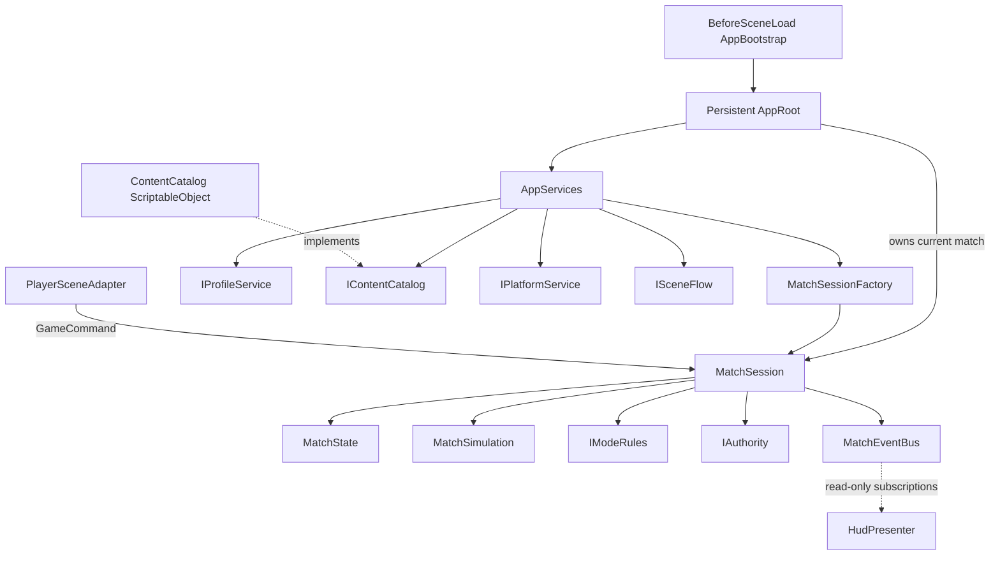

# Core Foundation

This directory contains the clean-slate game core. Its assemblies use the `TeamHJD.Game.*` namespace and do not depend on legacy game code.

## Assemblies

```text
TeamHJD.Game.Domain
TeamHJD.Game.Contracts → Domain
TeamHJD.Game.Application → Contracts, Domain
TeamHJD.Game.Content.Authoring → Domain
TeamHJD.Game.Content.Runtime → Contracts, Domain, Content.Authoring
TeamHJD.Game.Infrastructure.Fakes → Contracts, Domain
TeamHJD.Game.Infrastructure → Contracts, Domain
TeamHJD.Game.Presentation → Application, Contracts, Domain
TeamHJD.Game.Bootstrap → Application, Content.Runtime, Infrastructure, Fakes, Presentation
TeamHJD.Game.Tests.EditMode → Core assemblies (Editor only)
```

References point from the using assembly to the referenced assembly. Bootstrap is the composition boundary. Domain, Contracts, and Application do not reference Unity assemblies.

## Intended folders

```text
Bootstrap/                    Unity entry point and app composition
Core/Domain/                  Runtime models and rule contracts
Core/Contracts/               Ports consumed by application/core
Core/Application/             Match lifecycle and use case coordination
Content/Authoring/            Unity authoring assets and definitions
Content/Runtime/              Runtime catalog and config resolution
Infrastructure/Fakes/         Test/development implementations of ports
Infrastructure/               Platform, persistence, backend, network adapters
Presentation/Scene/           Scene composition and Unity adapters
Presentation/UI/              Views and presenters
Tests/EditMode/               Focused deterministic Core tests
```

All C# files begin with a role summary of no more than seven lines. The folder name `PoC` is the current project location; the Core structure and contracts are designed as the real foundation.

## Runtime composition

`AppBootstrap` resets a private guard at `SubsystemRegistration` and creates one persistent `AppRoot` at `BeforeSceneLoad`; no scene component or runtime object search is required. It loads an optional `ContentCatalog` from `Resources/Core/ContentCatalog` and otherwise uses an empty fake catalog. The bootstrap currently composes in-memory profile/platform/scene fakes and local authority so the object graph can be inspected without production SDKs. Replace those adapters in composition before shipping.

`AppRoot` owns the current `MatchSession` lifecycle. `AppServices` is only a typed dependency bundle and factory holder. `StartMatch` receives already-resolved `MatchConfig`, initialized `MatchState`, and mode rules; `CompleteCurrentMatch` returns the result plus reward proposal, and `EndCurrentMatch` disposes the match scope. A scene adapter can submit commands, while presenters bind through read-only state snapshots and event subscriptions.



App and Match scopes are explicit and disposable; no static service locator or gameplay Manager singleton is introduced. Network authority/transport, profile persistence, backend validation, Steam integration, mode rules, and gameplay command handlers are extension points, not implemented behavior in this foundation.
