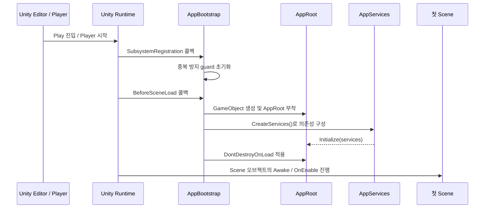
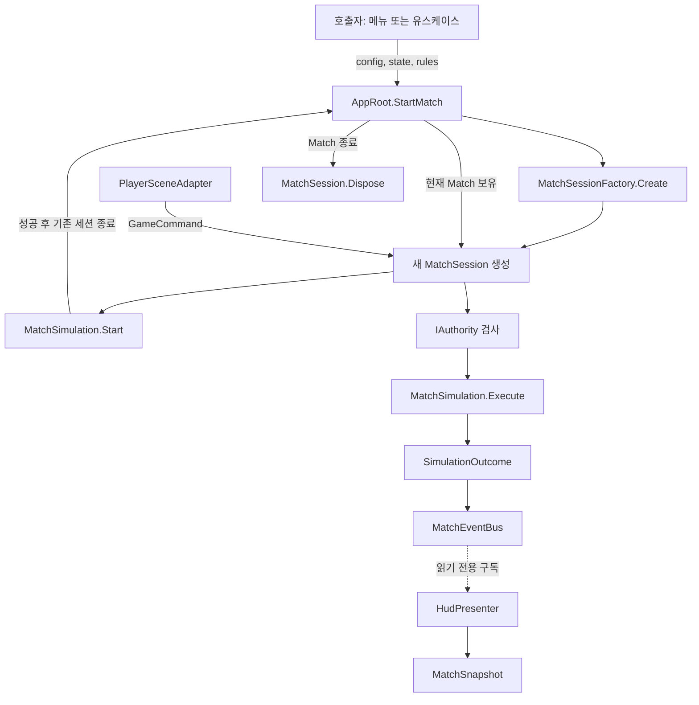
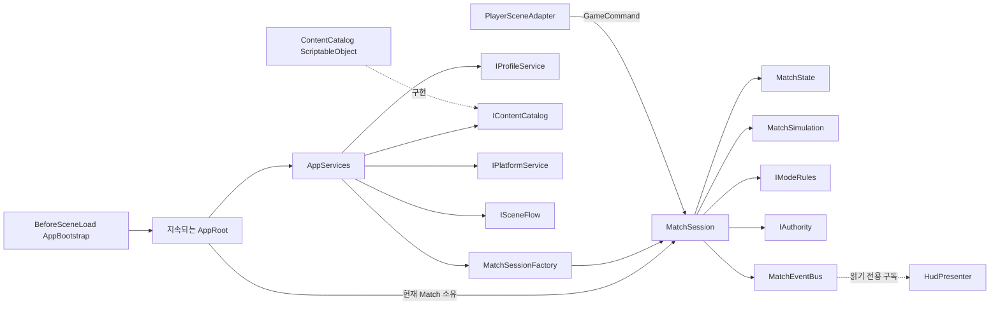

# Core Foundation

이 디렉터리는 기존 게임 코드와 연결하지 않고 새로 구성한 게임 Core의 기반 구조입니다. 코드는 `TeamHJD.Game.*` namespace를 사용하며, 기존 `Global`/`Game`/Manager 구조와 호환된다고 가정하지 않습니다. 현재는 생명주기와 의존성의 골격을 만든 상태이며 전투·웨이브·보상 등의 실제 규칙은 아직 구현되지 않았습니다.

## 어셈블리와 의존성

```text
TeamHJD.Game.Domain
TeamHJD.Game.Contracts → Domain
TeamHJD.Game.Application → Contracts, Domain
TeamHJD.Game.Content.Authoring → Domain
TeamHJD.Game.Content.Runtime → Contracts, Domain, Content.Authoring
TeamHJD.Game.Infrastructure.Fakes → Contracts, Domain
TeamHJD.Game.Infrastructure → Contracts, Domain
TeamHJD.Game.Presentation → Application, Contracts, Domain
TeamHJD.Game.Bootstrap → Application, Content.Runtime, Infrastructure, Fakes, Presentation
TeamHJD.Game.Tests.EditMode → Core assemblies (Editor only)
```

화살표는 왼쪽 어셈블리가 오른쪽 어셈블리를 참조한다는 뜻입니다. `Bootstrap`은 구체적인 구현들을 조립하는 Composition Root입니다. `Domain`, `Contracts`, `Application`은 Unity API를 참조하지 않습니다.

## 디렉터리

```text
Bootstrap/                    Unity 진입점과 앱 구성
Core/Domain/                  Match 데이터, 명령, 이벤트, 규칙 경계
Core/Contracts/               앱이 사용하는 외부 기능 계약(Port)
Core/Application/             Match 수명주기와 유스케이스 조정
Content/Authoring/            Unity에서 편집하는 ScriptableObject 정의
Content/Runtime/              정의를 찾아 MatchConfig로 해석
Infrastructure/Fakes/         테스트·개발용 메모리 구현
Infrastructure/               저장소, 플랫폼, Backend, 네트워크 구현이 들어갈 경계
Presentation/Scene/            Scene 입력을 Core 명령으로 연결하는 Adapter
Presentation/UI/               상태를 화면에 표현하는 Presenter/View 경계
Tests/EditMode/                결정적인 Core 단위 테스트
```

모든 C# 파일 맨 위에는 해당 파일의 역할을 한국어로 설명하는 짧은 주석을 둡니다. 업계에서 통용되는 타입명과 API명은 코드와 일치하도록 영어로 유지하고, 설명은 한국어로 작성합니다.

## Play 진입부터 App 생성까지

`AppBootstrap`을 Scene 오브젝트에 붙여 두는 방식이 아닙니다. Unity 런타임이 Play 진입 또는 Player 실행 시 런타임 초기화 콜백을 호출하고, Attribute로 등록된 정적 메서드를 실행합니다.



`RuntimeInitializeOnLoadMethod`는 Unity가 정적 메서드를 런타임 시작 시점에 호출하도록 등록하는 장치입니다. Unity 6 실행 순서에서 `SubsystemRegistration`은 첫 Scene 로드보다 앞서 호출되어 이전 Play 세션의 정적 guard를 초기화하고, `BeforeSceneLoad`는 첫 Scene 오브젝트가 메모리에 올라온 뒤 `Awake`가 호출되기 전에 실행됩니다. 따라서 흔히 “씬 생성 전”이라고 줄여 말하지만 정확히는 **Scene의 `Awake`보다 먼저**입니다. 이 콜백의 호출 주체는 프로젝트 코드가 아니라 Unity 엔진입니다. Editor의 Enter Play Mode도 같은 콜백 단계를 보장합니다. [Unity 실행 순서 문서](https://docs.unity3d.com/6000.0/Documentation/ScriptReference/RuntimeInitializeOnLoadMethodAttribute.html)

현재 [`AppBootstrap.cs`](Bootstrap/AppBootstrap.cs)의 실제 단계는 다음과 같습니다.

1. `ResetForNewRuntimeSession()` — `SubsystemRegistration`에서 `_hasBootstrapped`를 `false`로 되돌립니다. Domain Reload가 꺼진 Editor 설정에서도 새 런타임 진입마다 가드를 초기화하기 위한 단계입니다.
2. `CreateAppRoot()` — `BeforeSceneLoad`에서 한 번만 실행합니다. 새 `GameObject`를 만들고 `AppRoot` 컴포넌트를 붙입니다.
3. `CreateServices()` — `Resources/Core/ContentCatalog`의 `ContentCatalog`를 찾습니다. 없으면 경고를 남기고 `FakeContentCatalog`를 사용합니다. 현재 Profile·Platform·SceneFlow도 메모리 Fake이며, 권한 구현은 `LocalAuthority`입니다.
4. `root.Initialize(...)` — 생성한 서비스 묶음을 `AppRoot`에 전달합니다.
5. `DontDestroyOnLoad(rootObject)` — Scene이 바뀌어도 앱 루트가 유지되도록 합니다. Unity API는 root GameObject에만 적용할 수 있고 자식 계층도 함께 유지합니다. [Unity DontDestroyOnLoad 문서](https://docs.unity3d.com/6000.0/Documentation/ScriptReference/Object.DontDestroyOnLoad.html)

이 시점에 **Match는 시작되지 않습니다.** App 구성만 끝난 상태입니다. 현재 테스트용 Fake SceneFlow는 요청을 기록할 뿐 실제 Scene을 로드하지 않으며, 메뉴/Scene에서 `StartMatch`를 호출하도록 연결한 실제 게임 진입도 아직 없습니다.

## Match를 시작하고 명령을 처리하는 흐름

실제 게임 흐름이 연결되면 상위 메뉴/유스케이스가 콘텐츠와 플레이어 데이터를 준비한 뒤 `AppRoot.StartMatch(config, initialState, modeRules)`를 호출합니다. 현재는 이 세 입력을 호출자가 제공해야 합니다. 프로필 로드나 `MatchSelection → Content.ResolveMatchConfig` 연결은 자동 실행되지 않습니다.



주요 Method 흐름:

| Method | 호출/역할 |
| --- | --- |
| `AppRoot.StartMatch` | 새 세션을 Factory로 만들고 `Start()`를 호출합니다. 시작에 성공하면 기존 세션을 정리하고 새 세션을 App의 현재 세션으로 보유합니다. |
| `MatchSessionFactory.Create` | Match 단위 객체 그래프(`MatchSimulation`, 이벤트 버스 등)를 생성해 `MatchSession`에 묶습니다. |
| `MatchSession.Start` | 초기 상태가 `Preparing`인지 확인한 뒤 `Running`으로 전이합니다. |
| `PlayerSceneAdapter.Bind` | Scene 입력 Adapter에 세션을 연결합니다. `Submit`은 받은 `GameCommand`를 세션에 전달합니다. Scene 연결은 현재 자동 구성되지 않았습니다. |
| `MatchSession.Submit` | 권한을 검사하고 통과하면 Simulation에 명령을 전달합니다. 결과 이벤트를 Match-local 버스에 발행합니다. |
| `MatchSimulation.Execute` | Domain 상태를 변경하는 경계입니다. 현재는 전투 명령 처리기가 의도적으로 없어서 `NotHandled`를 반환합니다. |
| `HudPresenter.Bind` | Match 이벤트를 구독하고 즉시 Snapshot을 그립니다. 이후 이벤트마다 최신 Snapshot을 View에 전달합니다. |
| `AppRoot.CompleteCurrentMatch` | `MatchSession.Complete`에 완료 결과를 요청합니다. `IModeRules`가 결과와 보상 제안을 만들고 완료 이벤트를 발행합니다. |
| `AppRoot.EndCurrentMatch` | 현재 Match를 Dispose하고 App의 Match 참조를 비웁니다. |
| `AppRoot.OnDestroy` | 앱 루트가 제거/종료될 때 Match와 앱 서비스들을 정리합니다. |

현재 `CompleteCurrentMatch`는 구조만 준비된 API로, 실제 플레이 흐름에서 호출되도록 연결되어 있지는 않습니다. `FakeProfileService`도 앱 구성 시 생성되지만 현재 어느 Method에서도 로드/저장을 호출하지 않습니다. Fake는 프로필 API 대체 구현일 뿐 저장 파일이나 Backend 데이터가 아닙니다.

## 왜 GameManager 하나 대신 App 수명주기를 두는가

`GameManager`라는 이름이나 Manager 컴포넌트 자체가 잘못된 것은 아닙니다. 작은 게임에서는 하나의 Scene 안에서 점수·일시정지·라운드를 관리하는 `GameManager`가 가장 단순하고 적절할 수 있습니다. 이 구조가 구분하려는 것은 이름이 아니라 **수명과 책임의 범위**입니다.

- **App Scope:** Scene 교체 전후에도 필요한 플랫폼 로그인, 프로필 저장, 앱 설정, 서비스 구성처럼 게임 실행 전체에 걸친 기능.
- **Match Scope:** 한 판의 상태, 권한, Simulation, 이벤트처럼 Match 종료 시 함께 폐기되어야 하는 기능.
- **Scene/UI Scope:** 현재 Scene 입력과 화면 표현처럼 Scene 전환 시 해제되어야 하는 기능.

전역 `GameManager` 하나가 이 모두를 맡으면 Match 데이터가 Scene 사이에 남거나, Scene 오브젝트를 전역 객체가 붙잡거나, 테스트에서 전역 상태를 초기화해야 하는 문제가 생기기 쉽습니다. 여기서는 `AppRoot`가 앱 수준 객체의 생성·폐기 경계와 Composition Root를 맡고, 매 판 데이터는 별도 `MatchSession`에 둡니다. Scene/UI는 필요한 세션을 명시적으로 받아 연결합니다. 새 테스트 Scene은 자체 구성으로 필요한 서비스와 Match를 만들 수 있어 다른 Scene이나 과거 테스트의 전역 상태에 덜 얽힙니다.

이 방식은 Dependency Injection/Composition Root와 수명주기 Scope를 명시하는 일반적인 애플리케이션 아키텍처 접근과 맞닿아 있습니다. .NET DI의 공식 지침도 Singleton/Scoped/Transient를 구분하고, 긴 수명의 객체가 짧은 Scope 객체를 붙잡아 수명을 늘려버리는 실수를 경고합니다. 이는 특정 엔진이나 모든 게임 스튜디오가 반드시 쓰는 한 가지 표준이라는 뜻은 아닙니다. Unity 프로젝트에서는 간단한 Scene Manager, 수동 Composition Root, DI Container(Project/Scene Context 등)를 프로젝트 규모와 팀 취향에 따라 선택합니다. 우리 구조는 별도 DI 패키지 없이 App/Match 경계를 수동으로 구성하는 작은 Composition Root입니다. [Microsoft 서비스 수명 지침](https://learn.microsoft.com/en-us/dotnet/core/extensions/dependency-injection/service-lifetimes)

기대 효과는 다음과 같습니다.

- 의존성을 어디서 만들고 누구에게 전달하는지 `AppBootstrap`/`AppRoot`에서 추적할 수 있습니다.
- Scene 간 생존 객체를 최소화하고, App / Match / Scene의 종료 시점을 명확히 할 수 있습니다.
- `MatchSession`을 별도로 만들어 Play Mode 씬, Edit Mode 테스트, 향후 네트워크 세션에서 재사용·검증하기 쉬워집니다.
- Fake와 실제 저장/플랫폼/네트워크 구현을 계약 단위로 교체할 수 있고, Domain/Application은 Unity나 SDK에 덜 종속됩니다.
- 향후 Host 권한, 로컬/원격 입력을 Match의 Command 경계로 통합할 수 있는 자리를 확보합니다. 단, 현재 네트워크·온라인 처리가 구현된 것은 아닙니다.

비용과 주의점도 있습니다. 구성 타입과 명시적 연결이 늘고, 초기에는 작은 게임에 비해 보일러플레이트가 생깁니다. 또한 App Scope에 모든 Manager를 몰아넣으면 거대한 전역 객체가 다시 만들어집니다. 그래서 App에는 진짜 앱 전체 수명 서비스만 두고, Match/Scene 책임은 각자의 Scope에 둡니다. **이 설계는 Singleton을 다른 이름으로 감춘 것이 아닙니다.** AppRoot만 Scene 사이에 남는 Unity 객체이고, 접근은 static `Instance`가 아니라 전달된 참조를 사용합니다.

## 현재/목표 경계

`AppRoot`는 앱 범위 구성의 Unity 소유자이며 `AppServices`는 typed dependency 묶음입니다. `AppRoot`가 현재 `MatchSession`을 보유하고, Match는 `MatchSessionFactory`가 생성합니다. Match 이벤트는 Match-local이며 Presentation에는 구독 전용 인터페이스로 노출합니다.



전투/웨이브/경제 규칙, 완성된 `IModeRules`, 정의 데이터로 초기 MatchState를 만드는 Factory, 로컬 바이너리 저장, Backend 검증, Steam, 네트워크·Host Migration, 실제 HUD View 및 Scene 연결은 아직 구현하지 않았습니다. 실제 adapter를 붙이기 전까지 Bootstrap은 개발용 Fake를 사용합니다.

## 관련 공식 문서

- [Unity 런타임 초기화 콜백과 실행 순서](https://docs.unity3d.com/6000.0/Documentation/ScriptReference/RuntimeInitializeOnLoadMethodAttribute.html)
- [Unity `DontDestroyOnLoad`](https://docs.unity3d.com/6000.0/Documentation/ScriptReference/Object.DontDestroyOnLoad.html)
- [Microsoft DI 서비스 수명](https://learn.microsoft.com/en-us/dotnet/core/extensions/dependency-injection/service-lifetimes)
