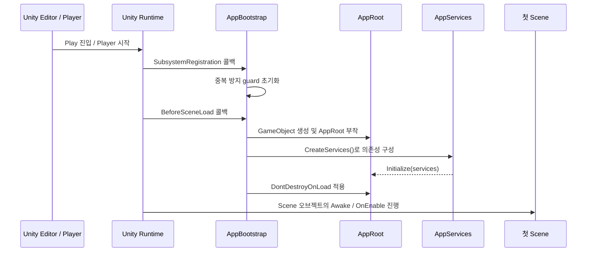
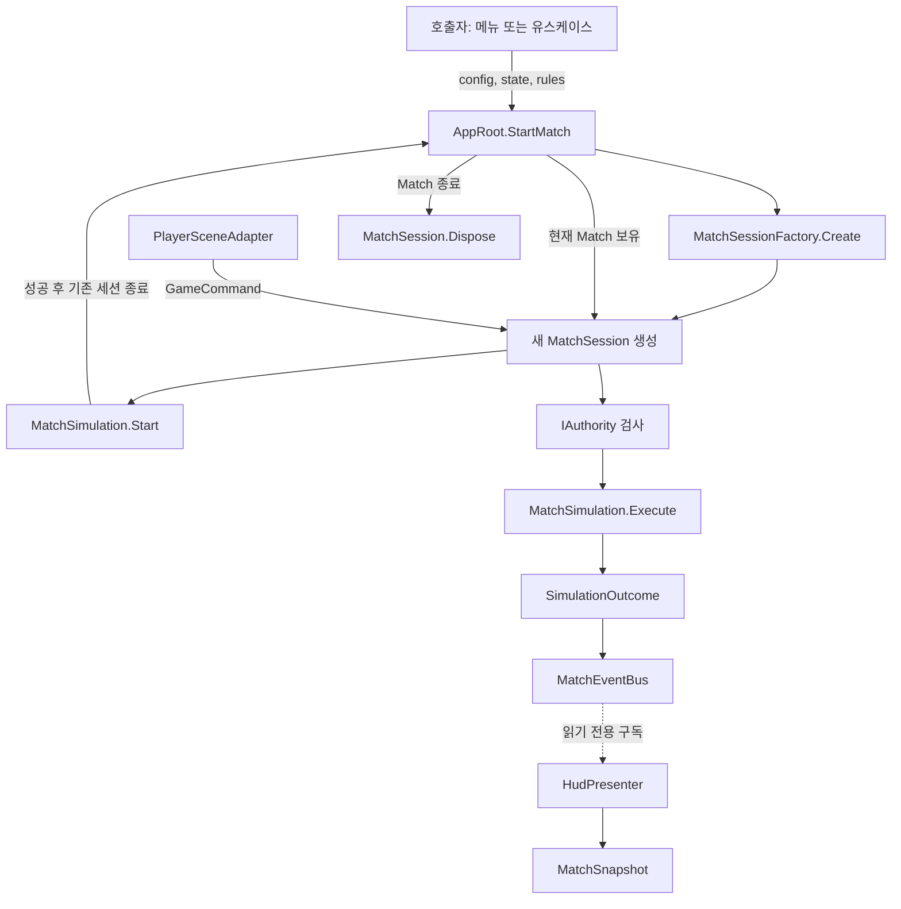
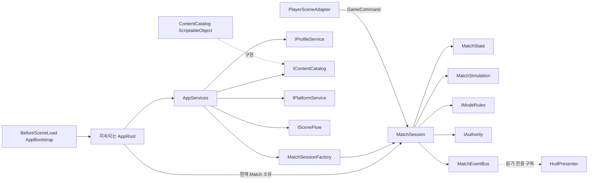

# Core Foundation

이 디렉터리는 기존 게임 코드와 연결하지 않고 새로 구성한 게임 Core의 기반 구조입니다. 코드는 `TeamHJD.Game.*` namespace를 사용하며, 기존 `Global`/`Game`/Manager 구조와 호환된다고 가정하지 않습니다. 현재는 생명주기와 의존성의 골격을 만든 상태이며 전투·웨이브·보상 등의 실제 규칙은 아직 구현되지 않았습니다.

## 어셈블리와 의존성

```text
TeamHJD.Game.Domain
TeamHJD.Game.Contracts → Domain
TeamHJD.Game.Application → Contracts, Domain
TeamHJD.Game.Content.Authoring → Domain
TeamHJD.Game.Content.Runtime → Content.Authoring, Contracts, Domain
TeamHJD.Game.Infrastructure → Contracts, Domain
TeamHJD.Game.Infrastructure.Fakes → Contracts, Domain
TeamHJD.Game.Presentation → Application, Contracts, Domain
TeamHJD.Game.Bootstrap → Application, Content.Runtime, Contracts, Domain, Infrastructure, Fakes, Presentation
TeamHJD.Game.Editor → Bootstrap, Domain (Editor only)
TeamHJD.Game.Tests.EditMode → Application, Content.Runtime, Contracts, Domain, Fakes (Editor only)
```

화살표는 왼쪽 어셈블리가 오른쪽 어셈블리를 참조한다는 뜻입니다. 실제 각 asmdef 경로는 아래 트리에 적었습니다. `Bootstrap`은 구체 구현을 조립하는 Composition Root입니다. `Domain`, `Contracts`, `Application`, `Infrastructure.Fakes`는 Unity Engine 참조를 금지하는 asmdef 설정(`noEngineReferences`)을 사용합니다. `Infrastructure` asmdef는 현재 코드 구현이 없는 확장 경계입니다.

## 디렉터리

```text
Assets/PoC/Core/
├─ Bootstrap/
│  ├─ AppBootstrap.cs
│  ├─ AppRoot.cs
│  └─ TeamHJD.Game.Bootstrap.asmdef
├─ Application/
│  ├─ AppServices.cs
│  ├─ CommandSubmissionResult.cs
│  ├─ CommandSubmissionStatus.cs
│  ├─ LocalAuthority.cs
│  ├─ MatchEventBus.cs
│  ├─ MatchSession.cs
│  ├─ MatchSessionFactory.cs
│  ├─ BattlefieldSpatialRuntime.cs
│  └─ TeamHJD.Game.Application.asmdef
├─ Content/
│  ├─ Authoring/
│  │  ├─ DifficultyProfileDefinition.cs
│  │  ├─ StageDefinition.cs
│  │  └─ TeamHJD.Game.Content.Authoring.asmdef
│  └─ Runtime/
│     ├─ ContentCatalog.cs
│     └─ TeamHJD.Game.Content.Runtime.asmdef
├─ Contracts/
│  ├─ CommandAuthorization.cs
│  ├─ IAuthority.cs
│  ├─ IContentCatalog.cs
│  ├─ IMatchEventStream.cs
│  ├─ IPlatformService.cs
│  ├─ IProfileService.cs
│  ├─ ISceneFlow.cs
│  ├─ PlatformUser.cs
│  └─ TeamHJD.Game.Contracts.asmdef
├─ Domain/
│  ├─ Commands/ (GameCommand 및 5개 구체 명령)
│  ├─ Economy/ (CurrencyBalance, CurrencyDelta, RewardReceipt)
│  ├─ Events/ (MatchEvent 및 구체 이벤트 6개)
│  ├─ Identifiers/ (CurrencyId, DefinitionId, EntityId, MatchId, PlayerId, StageId)
│  ├─ Internal/CollectionCopy.cs
│  ├─ Match/ (설정, 상태, 생명주기, Simulation, 결과, 규칙)
│  ├─ Battlefield/ (터렛 공간 입력, Territory topology, 경계 변 snapshot)
│  ├─ Players/ (PlayerState와 Profile/Loadout Snapshot)
│  ├─ World/ (ControlUnit, Enemy, Sector, Turret, Wave 상태)
│  └─ TeamHJD.Game.Domain.asmdef
├─ Infrastructure/
│  ├─ Fakes/
│  │  ├─ FakeContentCatalog.cs
│  │  ├─ FakePlatformService.cs
│  │  ├─ FakeProfileService.cs
│  │  ├─ FakeSceneFlow.cs
│  │  └─ TeamHJD.Game.Infrastructure.Fakes.asmdef
│  └─ TeamHJD.Game.Infrastructure.asmdef
├─ Presentation/
│  ├─ Scene/PlayerSceneAdapter.cs
│  ├─ UI/HudPresenter.cs
│  ├─ UI/IHudView.cs
│  └─ TeamHJD.Game.Presentation.asmdef
├─ Editor/
│  ├─ BattlefieldDebugWindow.cs
│  └─ TeamHJD.Game.Editor.asmdef (Editor 전용)
├─ Tests/EditMode/
│  ├─ BattlefieldTopologyBuilderTests.cs
│  └─ TeamHJD.Game.Tests.EditMode.asmdef
└─ README.md
```

트리는 `.cs`, `.asmdef`, `.md` 파일을 기준으로 현재 디렉터리를 요약하며 Unity `.meta` 파일은 생략했습니다. `Domain/Battlefield`는 순수 입력·계산·결과 타입, `Application/BattlefieldSpatialRuntime`은 Match 수명 경계, `Editor`는 Scene View 표시, `Tests/EditMode`는 해당 Domain 계산을 검증하는 코드입니다. 이 분리는 실제 의존 경계와 일치합니다. namespace는 계속 `TeamHJD.Game.*`로 유지하므로 물리 경로가 코드 의존성이나 타입 이름을 바꾸지는 않습니다.

모든 C# 파일 맨 위에는 해당 파일의 역할을 한국어로 설명하는 짧은 주석을 둡니다. 업계에서 통용되는 타입명과 API명은 코드와 일치하도록 영어로 유지하고, 설명은 한국어로 작성합니다.

## 용어 빠른 안내

| 용어 | 쉽게 말하면 | 현재 Core에서의 예 |
| --- | --- | --- |
| Core | 게임 규칙과 실행 기반을 담는 코드 영역 | 이 디렉터리 전체 |
| Domain | 게임에서 쓰는 데이터와 규칙의 중심 영역 | `MatchState`, `PlayerState`, `GameCommand` 등. 현재는 모델과 경계가 있고 실제 전투 규칙은 없음 |
| Application | 여러 Domain 동작의 순서와 수명을 조정 | `MatchSession`, `AppServices` |
| Contract / Port | 외부 기능을 어떤 메서드로 쓸지 약속한 인터페이스 | `IProfileService`, `IContentCatalog` |
| Adapter | 계약을 실제 기술에 연결하는 구현 | 앞으로 만들 Steam·저장소 구현. 지금 `FakeProfileService`가 같은 계약을 임시 구현 |
| Bootstrap / Composition Root | 앱 시작 때 구체 객체를 만들고 서로 연결하는 조립 지점 | `AppBootstrap.CreateServices()` |
| Scope | 객체가 살아 있는 범위와 정리 시점 | 앱 전체인 App Scope, 한 판인 Match Scope, 한 Scene인 Scene Scope |
| Catalog | 콘텐츠 정의를 찾아주는 목록/조회 창구 | 현재 `ContentCatalog`는 Stage/Difficulty ID 등록 여부 확인과 `MatchConfig` 생성만 함 |
| Definition | 제작자가 편집하는 고정 콘텐츠 원본 | `StageDefinition`, `DifficultyProfileDefinition` |
| Selection | 플레이어가 고른 매치 시작 입력 | `MatchSelection` |
| Config | 매치 시작 전에 확정해 둔 실행 설정 | `MatchConfig`; 현재 호출자가 만들어 전달 |
| State | 지금 플레이 중인 매치의 기준 상태 | `MatchState`; Match가 끝날 때까지 변함 |
| Snapshot | 현재 State를 외부에 보여주기 위해 떼어낸 시점 복사본 | `MatchSnapshot`; 그 자체로 저장/복구 기능을 제공하진 않음 |
| Command | “이 동작을 해 달라”는 요청 | `FireCommand`, `StartWaveCommand`; 현재 Simulation Handler는 미구현 |
| Event | “이 일이 이미 발생했다”는 사실 | `WaveStarted`, `PlayerHealthChanged`; 발행 기능은 있으나 실제 전투 이벤트는 미구현 |
| Authority | 명령을 실행해도 되는 주체인지 검사하는 정책 | 현재 `LocalAuthority`는 Match roster의 Player인지 확인 |
| Simulation | 명령을 규칙에 따라 적용하고 상태 전이를 수행하는 경계 | 현재 `MatchSimulation.Execute()`는 `NotHandled`를 반환 |
| Presenter / View | Presenter는 데이터를 화면에 전달, View는 실제로 그림 | `HudPresenter` / `IHudView`; 실제 View와 자동 연결은 없음 |
| Fake | 실제 외부 시스템 대신 테스트용으로 동작하는 대체 객체 | `FakeProfileService`는 데이터를 메모리에만 보관 |
| asmdef / Assembly | asmdef는 Unity 컴파일 단위를 정하고, Assembly는 빌드되는 코드 묶음 | `TeamHJD.Game.Domain.asmdef` |
| namespace | 코드 타입의 정식 이름을 묶는 이름 공간. 폴더와 반드시 같을 필요는 없음 | 폴더는 `Domain/Match/`, namespace는 `TeamHJD.Game.Domain` |

### C# 문법도 헷갈릴 때

- `sealed class`: 이 클래스를 상속해 파생 클래스를 만들 수 없다는 뜻입니다. 교체 지점은 상속 대신 계약(interface) 구현으로 둡니다.
- `IDisposable` / `Dispose()`: 사용이 끝난 객체가 보유한 구독이나 자원을 정리하도록 알리는 약속/메서드입니다. 메모리에서 즉시 삭제하거나 Unity `Destroy`를 호출하는 뜻은 아닙니다.
- `left ?? right`: `left`가 null이 아니면 left를, null이면 right 값을 선택합니다. `left ??= value`는 left가 null일 때만 대입합니다.

## Play 진입부터 App 생성까지

`AppBootstrap`을 Scene 오브젝트에 붙여 두는 방식이 아닙니다. Unity 런타임이 Play 진입 또는 Player 실행 시 런타임 초기화 콜백을 호출하고, Attribute로 등록된 정적 메서드를 실행합니다.


```mermaid
sequenceDiagram
    participant E as Unity Editor / Player
    participant U as Unity Runtime
    participant B as AppBootstrap
    participant R as AppRoot
    participant S as AppServices
    participant SC as 첫 Scene

    E->>U: Play 진입 / Player 시작
    U->>B: SubsystemRegistration 콜백
    B->>B: 중복 방지 guard 초기화
    U->>B: BeforeSceneLoad 콜백
    B->>R: GameObject 생성 및 AppRoot 부착
    B->>S: CreateServices()로 의존성 구성
    S-->>R: Initialize(services)
    B->>R: DontDestroyOnLoad 적용
    U->>SC: Scene 오브젝트의 Awake / OnEnable 진행
```

`RuntimeInitializeOnLoadMethod`는 Unity가 정적 메서드를 런타임 시작 시점에 호출하도록 등록하는 장치입니다. Unity 6 실행 순서에서 `SubsystemRegistration`은 첫 Scene 로드보다 앞서 호출되어 이전 Play 세션의 정적 guard를 초기화하고, `BeforeSceneLoad`는 첫 Scene 오브젝트가 메모리에 올라온 뒤 `Awake`가 호출되기 전에 실행됩니다. 따라서 흔히 “씬 생성 전”이라고 줄여 말하지만 정확히는 **Scene의 `Awake`보다 먼저**입니다. 이 콜백의 호출 주체는 프로젝트 코드가 아니라 Unity 엔진입니다. Editor의 Enter Play Mode도 같은 콜백 단계를 보장합니다. [Unity 실행 순서 문서](https://docs.unity3d.com/6000.0/Documentation/ScriptReference/RuntimeInitializeOnLoadMethodAttribute.html)

현재 [`AppBootstrap.cs`](Bootstrap/AppBootstrap.cs)의 실제 단계는 다음과 같습니다.

1. `ResetForNewRuntimeSession()` — `SubsystemRegistration`에서 `_hasBootstrapped`를 `false`로 되돌립니다. Domain Reload가 꺼진 Editor 설정에서도 새 런타임 진입마다 가드를 초기화하기 위한 단계입니다.
2. `CreateAppRoot()` — `BeforeSceneLoad`에서 한 번만 실행합니다. 새 `GameObject`를 만들고 `AppRoot` 컴포넌트를 붙입니다.
3. `CreateServices()` — `Resources/Core/ContentCatalog`의 `ContentCatalog`를 찾습니다. 없으면 경고를 남기고 `FakeContentCatalog`를 사용합니다. 현재 Profile·Platform·SceneFlow도 메모리 Fake이며, 권한 구현은 `LocalAuthority`입니다.
4. `root.Initialize(...)` — 생성한 서비스 묶음을 `AppRoot`에 전달합니다.
5. `DontDestroyOnLoad(rootObject)` — Scene이 바뀌어도 앱 루트가 유지되도록 합니다. Unity API는 root GameObject에만 적용할 수 있고 자식 계층도 함께 유지합니다. [Unity DontDestroyOnLoad 문서](https://docs.unity3d.com/6000.0/Documentation/ScriptReference/Object.DontDestroyOnLoad.html)

이 시점에 **Match는 시작되지 않습니다.** App 구성만 끝난 상태입니다. 현재 테스트용 Fake SceneFlow는 요청을 기록할 뿐 실제 Scene을 로드하지 않으며, 메뉴/Scene에서 `StartMatch`를 호출하도록 연결한 실제 게임 진입도 아직 없습니다.

## Match를 시작하고 명령을 처리하는 흐름

실제 게임 흐름이 연결되면 상위 메뉴/유스케이스가 콘텐츠와 플레이어 데이터를 준비한 뒤 `AppRoot.StartMatch(config, initialState, modeRules)`를 호출합니다. 현재는 이 세 입력을 호출자가 제공해야 합니다. 프로필 로드나 `MatchSelection → Content.ResolveMatchConfig` 연결은 자동 실행되지 않습니다.


```mermaid
flowchart TD
    Caller[호출자: 메뉴 또는 유스케이스] -->|config, state, rules| Root[AppRoot.StartMatch]
    Root --> Factory[MatchSessionFactory.Create]
    Factory --> Session[새 MatchSession 생성]
    Session --> Start[MatchSimulation.Start]
    Start -->|성공 후 기존 세션 종료| Root
    Root -->|현재 Match 보유| Session
    Input[PlayerSceneAdapter] -->|GameCommand| Session
    Session --> Authority[IAuthority 검사]
    Authority --> Simulation[MatchSimulation.Execute]
    Simulation --> Outcome[SimulationOutcome]
    Outcome --> Bus[MatchEventBus]
    Bus -. 읽기 전용 구독 .-> Presenter[HudPresenter]
    Presenter --> Snapshot[MatchSnapshot]
    Root -->|Match 종료| Dispose[MatchSession.Dispose]
```

주요 Method 흐름:

| Method | 호출/역할 |
| --- | --- |
| `AppRoot.StartMatch` | 새 세션을 Factory로 만들고 `Start()`를 호출합니다. 시작에 성공하면 기존 세션을 정리하고 새 세션을 App의 현재 세션으로 보유합니다. |
| `MatchSessionFactory.Create` | Match 단위 객체 그래프(`MatchSimulation`, 이벤트 버스 등)를 생성해 `MatchSession`에 묶습니다. |
| `MatchSession.Start` | 초기 상태가 `Preparing`인지 확인한 뒤 `Running`으로 전이합니다. |
| `PlayerSceneAdapter.Bind` | Scene 입력 Adapter에 세션을 연결합니다. `Submit`은 받은 `GameCommand`를 세션에 전달합니다. Scene 연결은 현재 자동 구성되지 않았습니다. |
| `MatchSession.Submit` | 권한을 검사하고 통과하면 Simulation에 명령을 전달합니다. 결과 이벤트를 Match-local 버스에 발행합니다. |
| `MatchSimulation.Execute` | Domain 상태를 변경하는 경계입니다. 현재는 전투 명령 처리기가 의도적으로 없어서 `NotHandled`를 반환합니다. |
| `HudPresenter.Bind` | Match 이벤트를 구독하고 즉시 Snapshot을 그립니다. 이후 이벤트마다 최신 Snapshot을 View에 전달합니다. |
| `AppRoot.CompleteCurrentMatch` | `MatchSession.Complete`에 완료 결과를 요청합니다. `IModeRules`가 결과와 보상 제안을 만들고 완료 이벤트를 발행합니다. |
| `AppRoot.EndCurrentMatch` | 현재 Match를 Dispose하고 App의 Match 참조를 비웁니다. |
| `AppRoot.OnDestroy` | 앱 루트가 제거/종료될 때 Match와 앱 서비스들을 정리합니다. |

현재 `CompleteCurrentMatch`는 구조만 준비된 API로, 실제 플레이 흐름에서 호출되도록 연결되어 있지는 않습니다. `FakeProfileService`도 앱 구성 시 생성되지만 현재 어느 Method에서도 로드/저장을 호출하지 않습니다. Fake는 프로필 API 대체 구현일 뿐 저장 파일이나 Backend 데이터가 아닙니다.

## Catalog와 Profile의 현재 범위

`ContentCatalog`는 앱 구성 때 선택해 `IContentCatalog`로 등록하지만, 앱 시작 시 특정 Stage나 난이도를 선택하지는 않습니다. 나중에 호출자가 `MatchSelection`을 넘기면 `ResolveMatchConfig`가 Stage/Difficulty ID가 Catalog에 등록되어 있는지 확인하고, 선택 입력과 Catalog 버전을 `MatchConfig`로 옮깁니다. 현재 Authoring Definition의 밸런스 값을 읽어 초기 `MatchState`를 만들거나, 전체 목록을 UI에 제공하거나, 플레이어 해금 여부를 확인하지는 않습니다.

`FakeContentCatalog`는 Stage/Difficulty ID를 미리 등록해 두고 같은 계약을 메모리에서 구현합니다. `FakeProfileService`는 `PlayerId`를 키로 프로필 Snapshot을 메모리에 읽고 씁니다. 둘 다 앱 구성용 대체 구현이며 실제 파일 저장·Backend·플레이어 계정 연동은 하지 않습니다. 현재 Bootstrap은 Fake profile을 만들지만 사용하지 않고, Match 시작 흐름도 Catalog를 호출하도록 연결되지 않았습니다.

## 왜 GameManager 하나 대신 App 수명주기를 두는가

`GameManager`라는 이름이나 Manager 컴포넌트 자체가 잘못된 것은 아닙니다. 작은 게임에서는 하나의 Scene 안에서 점수·일시정지·라운드를 관리하는 `GameManager`가 가장 단순하고 적절할 수 있습니다. 이 구조가 구분하려는 것은 이름이 아니라 **수명과 책임의 범위**입니다.

- **App Scope:** Scene 교체 전후에도 필요한 플랫폼 로그인, 프로필 저장, 앱 설정, 서비스 구성처럼 게임 실행 전체에 걸친 기능.
- **Match Scope:** 한 판의 상태, 권한, Simulation, 이벤트처럼 Match 종료 시 함께 폐기되어야 하는 기능.
- **Scene/UI Scope:** 현재 Scene 입력과 화면 표현처럼 Scene 전환 시 해제되어야 하는 기능.

전역 `GameManager` 하나가 이 모두를 맡으면 Match 데이터가 Scene 사이에 남거나, Scene 오브젝트를 전역 객체가 붙잡거나, 테스트에서 전역 상태를 초기화해야 하는 문제가 생기기 쉽습니다. 여기서는 `AppRoot`가 앱 수준 객체의 생성·폐기 경계와 Composition Root를 맡고, 매 판 데이터는 별도 `MatchSession`에 둡니다. Scene/UI는 필요한 세션을 명시적으로 받아 연결합니다. 새 테스트 Scene은 자체 구성으로 필요한 서비스와 Match를 만들 수 있어 다른 Scene이나 과거 테스트의 전역 상태에 덜 얽힙니다.

이 방식은 Dependency Injection/Composition Root와 수명주기 Scope를 명시하는 일반적인 애플리케이션 아키텍처 접근과 맞닿아 있습니다. .NET DI의 공식 지침도 Singleton/Scoped/Transient를 구분하고, 긴 수명의 객체가 짧은 Scope 객체를 붙잡아 수명을 늘려버리는 실수를 경고합니다. 이는 특정 엔진이나 모든 게임 스튜디오가 반드시 쓰는 한 가지 표준이라는 뜻은 아닙니다. Unity 프로젝트에서는 간단한 Scene Manager, 수동 Composition Root, DI Container(Project/Scene Context 등)를 프로젝트 규모와 팀 취향에 따라 선택합니다. 우리 구조는 별도 DI 패키지 없이 App/Match 경계를 수동으로 구성하는 작은 Composition Root입니다. [Microsoft 서비스 수명 지침](https://learn.microsoft.com/en-us/dotnet/core/extensions/dependency-injection/service-lifetimes)

기대 효과는 다음과 같습니다.

- 의존성을 어디서 만들고 누구에게 전달하는지 `AppBootstrap`/`AppRoot`에서 추적할 수 있습니다.
- Scene 간 생존 객체를 최소화하고, App / Match / Scene의 종료 시점을 명확히 할 수 있습니다.
- `MatchSession`을 별도로 만들어 Play Mode 씬, Edit Mode 테스트, 향후 네트워크 세션에서 재사용·검증하기 쉬워집니다.
- Fake와 실제 저장/플랫폼/네트워크 구현을 계약 단위로 교체할 수 있고, Domain/Application은 Unity나 SDK에 덜 종속됩니다.
- 향후 Host 권한, 로컬/원격 입력을 Match의 Command 경계로 통합할 수 있는 자리를 확보합니다. 단, 현재 네트워크·온라인 처리가 구현된 것은 아닙니다.

비용과 주의점도 있습니다. 구성 타입과 명시적 연결이 늘고, 초기에는 작은 게임에 비해 보일러플레이트가 생깁니다. 또한 App Scope에 모든 Manager를 몰아넣으면 거대한 전역 객체가 다시 만들어집니다. 그래서 App에는 진짜 앱 전체 수명 서비스만 두고, Match/Scene 책임은 각자의 Scope에 둡니다. **이 설계는 Singleton을 다른 이름으로 감춘 것이 아닙니다.** AppRoot만 Scene 사이에 남는 Unity 객체이고, 접근은 static `Instance`가 아니라 전달된 참조를 사용합니다.

## 현재/목표 경계

`AppRoot`는 앱 범위 구성의 Unity 소유자이며 `AppServices`는 typed dependency 묶음입니다. `AppRoot`가 현재 `MatchSession`을 보유하고, Match는 `MatchSessionFactory`가 생성합니다. Match 이벤트는 Match-local이며 Presentation에는 구독 전용 인터페이스로 노출합니다.


```mermaid
flowchart LR
    Bootstrap[BeforeSceneLoad AppBootstrap] --> Root[지속되는 AppRoot]
    Root --> Services[AppServices]
    Root -->|현재 Match 소유| Session[MatchSession]
    Services --> Factory[MatchSessionFactory]
    Services --> Profile[IProfileService]
    Services --> Content[IContentCatalog]
    Services --> Platform[IPlatformService]
    Services --> SceneFlow[ISceneFlow]
    Factory --> Session
    Session --> State[MatchState]
    Session --> Simulation[MatchSimulation]
    Session --> Rules[IModeRules]
    Session --> Authority[IAuthority]
    Session --> Bus[MatchEventBus]
    Bus -. 읽기 전용 구독 .-> Presenter[HudPresenter]
    Adapter[PlayerSceneAdapter] -->|GameCommand| Session
    Asset[ContentCatalog ScriptableObject] -. 구현 .-> Content
```

전투/웨이브/경제 규칙, 완성된 `IModeRules`, 정의 데이터로 초기 MatchState를 만드는 Factory, 로컬 바이너리 저장, Backend 검증, Steam, 네트워크·Host Migration, 실제 HUD View 및 Scene 연결은 아직 구현하지 않았습니다. 실제 adapter를 붙이기 전까지 Bootstrap은 개발용 Fake를 사용합니다.

## Match-scope 공간 분석 (현재 구현 상태)

이번 Sprint의 설계 방향에서는 Territory/Frontline을 Encounter 내부에 두지 않고, Match 범위의 공용 `BattlefieldSpatialRuntime`에서 생성하는 파생 데이터로 다룹니다. **Stage 1 PoC 목표는 2026-10-02에 갱신되어 Uniform Grid와 최소 Encounter → Spawn 실행 흐름까지 같은 PoC에서 확인하는 것으로 확장되었습니다.** 이 기능들은 현재 구현 상태와 동일시하면 안 됩니다. #458–#460이 Grid·Encounter·Editor 진단 범위를 추적하고, #420이 통합 흐름을 추적합니다.

```text
MatchState (authoritative state)
  → BattlefieldSpatialRuntime (derived spatial analysis)
      → Territory / Frontline snapshot (read-only)
          → future Encounter / SpawnPlanner
              → SpawnPlan → Unity/Network Spawn Executor

BattlefieldSpatial snapshot → Editor Debug Tool (visualization only)
```

현재 `BattlefieldPoint`, `TurretSpatialInput`, `BattlefieldSpatialInput`, `BattlefieldTopologyBuilder`가 Unity 독립 Domain에 구현되어 있습니다. 입력 점으로 Delaunay 삼각형을 만들고 변 인접 관계를 구성하며, 삼각형 하나만 공유하는 외곽 변을 Frontline으로 노출합니다. 점이 3개 미만이거나 공선이면 topology는 비지만 유효 입력 vertex는 보존하며, 동일 좌표의 터렛은 모호한 topology를 피하기 위해 예외 처리합니다. 계산은 좌표 범위를 먼저 축소해 정규화하고 고정 epsilon을 사용하며, 이 정밀도 정책은 검토 가능한 초기 구현입니다.

여기에 Uniform Grid 생산 경로를 추가했습니다. `BattlefieldGridConfiguration`은 XY 원점, Z 표시 평면, 맵 너비/높이, 가로/세로 셀 수를 보유합니다. 기본은 원점 `(0,0,0)`, 크기 `16×16`, 셀 분할 `16×16`이며 전부 구성 변경 가능합니다. 공간 조회는 XY만 사용합니다. 셀은 row-major `CellId = y * CellsX + x`를 사용하고, 동일한 Grid 설정 안에서 재현 가능한 ID입니다. 분할 설정을 바꾸면 CellId 의미도 바뀌므로 Match snapshot의 revision/config와 함께 해석해야 합니다. 내부 경계점은 양의 방향 셀에 속하며 맵의 최대 X/Y 경계는 마지막 셀에 포함됩니다. 범위 밖 입력은 무시하지 않고 종류별 out-of-bounds ID 목록에 기록합니다. 최대 셀 수는 과도한 메모리 할당을 막기 위해 262,144로 제한합니다.

`BattlefieldGridBuilder`는 전달된 Turret/Player/Enemy 위치만 셀별로 모읍니다. 결과인 `BattlefieldGridSnapshot`과 `BattlefieldGridCellSnapshot`은 셀 및 ID 목록을 정렬해 deterministic하게 노출하는 읽기 전용 snapshot입니다. 빈 셀은 occupant 목록을 공유하고, 점유 셀에서만 목록을 할당하며 `OccupiedCells` query도 제공합니다. 이것은 raw occupancy일 뿐 영향력, 위험도, 전술 우세, Spawn suitability를 계산하지 않습니다. Player/Enemy의 실제 위치 공급자와 tick/update cadence는 해당 Feature Owner 및 Encounter 쪽과 연결해야 합니다. Domain은 `UnityEngine`/`UnityEditor`/NGO에 의존하지 않습니다.

Match 생성 시 `BattlefieldSpatialRuntime`이 topology와 Grid를 조립합니다. Match 도중에는 `MatchSession.UpdateBattlefieldParticipants`, `UpdateBattlefieldTurretLayout`, `ReconfigureBattlefieldGrid`를 명시적으로 호출해 새 immutable snapshot/revision을 만듭니다. Dynamic occupancy 갱신은 topology를 다시 계산하지 않습니다. 아직 매 프레임 자동 갱신은 없으며, 호출 주기와 실제 위치 입력은 Feature/Match 조립 코드가 책임집니다. `MatchSession.Battlefield`는 항상 최신 snapshot을 반환합니다. Encounter는 이 read-only 결과를 입력으로 소비하고 `EncounterRuntime` 이후의 정책/SpawnPlan/실행은 E 담당이므로 여기서 구현하지 않았습니다.

### 팀 간 연결 API — 현재 공개된 것과 빈 경계

현재 호출할 수 있는 입력·조회 API는 다음과 같습니다.

```csharp
var spatialInput = new BattlefieldSpatialInput(new[]
{
    new TurretSpatialInput(turretEntityId, new BattlefieldPoint(x, y))
});

MatchSession session = appRoot.StartMatch(config, initialState, modeRules, spatialInput);
BattlefieldSpatialSnapshot snapshot = session.Battlefield;
```

- `BattlefieldSpatialInput` / `TurretSpatialInput`: Match 생성 시 전달하는 불변 초기 입력. 입력 ID는 현재 `EntityId`를 받습니다.
- `BattlefieldSpatialSnapshot`: `MatchId`, `Revision`, `Vertices`, `Triangles`, `EdgeAdjacencies`, `FrontlineEdges`, `Grid` 읽기 전용 결과.
- `BattlefieldGridConfiguration` / `BattlefieldGridSnapshot`: Grid 정의, 모든 셀의 raw occupancy, 좌표→셀 조회, out-of-bounds actor ID를 제공합니다.
- `BattlefieldDynamicSpatialInput`: Match 도중 변하는 Player/Enemy 위치를 명시적으로 전달하는 불변 입력입니다. 중복 ID와 null 항목은 거부됩니다.
- `AppRoot.StartMatch(..., staticInput, dynamicInput, gridConfiguration)`: Match 조립부가 초기 spatial inputs 및 Grid 설정을 전달하는 진입점. 반환된 `MatchSession`을 Encounter 등 필요한 소비자에게 명시적으로 넘깁니다.
- `MatchSession.Battlefield`: Match가 소유한 최신 immutable snapshot 조회.
- `MatchSession.UpdateBattlefieldParticipants(...)`: Player/Enemy 위치 갱신을 전달해 Grid만 다시 계산.
- `MatchSession.UpdateBattlefieldTurretLayout(...)`: Turret layout 변경을 전달해 Territory와 Grid 모두 다시 계산.
- `MatchSession.ReconfigureBattlefieldGrid(...)`: Origin/맵 크기/가로·세로 분할 변경을 Match 중 적용.
- 동일 갱신 API는 `AppRoot`에도 제공됩니다. Editor 진단에서는 이를 사용해 현재 Match 결과를 갱신합니다.
- `AppRoot.BattlefieldSnapshotChanged` / `CurrentBattlefieldSnapshot`: `UNITY_EDITOR` 전용이며 Debug Window만을 위한 진단 연결입니다. 게임 Feature API가 아닙니다.

실제 팀 통합에서 열려 있는 연결 지점도 분명히 구분해야 합니다.

1. **Turret → Core 입력 Adapter:** main의 병합 PR #457에서 추가된 `TurretSnapshot` 값 타입/API가 현재 통합 브랜치에 있습니다. #426은 아직 Open이며 소비자 합의·실제 사용 경로 검증을 남깁니다. 그 immutable snapshot을 Domain `TurretSpatialInput`으로 투영하는 adapter와 실제 좌표/단위 합의가 필요합니다. Core가 `TurretBase`, `Transform`, static registry를 직접 조회하지 않습니다.
2. **Match 생성자 → 다른 Runtime Feature:** `AppRoot`는 현재 Match를 private하게 보유하고, `StartMatch` 반환값 외에 `CurrentMatch` 조회 API가 없습니다. 현재는 Match를 만든 조립자가 `MatchSession`을 필요한 Feature에 주입해야 합니다. 서로 독립된 Feature가 나중에 임의로 현재 Match를 조회해야 한다면, static 접근자를 추가하기보다 Match-scope composition/injection API를 별도로 열어야 합니다.
3. **위치 입력 공급자/갱신 cadence:** Match API는 이미 명시적 Player/Enemy 입력 및 갱신 경계를 제공합니다. 이를 실제 Feature의 위치 snapshot과 연결하고, 몇 tick/이벤트마다 갱신할지 조립부가 결정해야 합니다. 임의 Scene scan이나 매 프레임 자동 rebuild는 하지 않습니다.
4. **Enemy/Encounter 소비:** Core는 `MatchSession.Battlefield` snapshot을 producer-side로 제공합니다. 이를 E 소유 `EncounterRuntime`에 주입하는 Composition 연결 및 Encounter/Spawn 실행은 아직 구현하지 않았습니다. 전선/Grid 결과 자체가 직접 Spawn을 결정하지 않습니다.

따라서 현 API는 **초기·갱신 spatial 입력을 받고 Territory/Frontline/Grid snapshot을 제공하는 생산 경계까지**입니다. E handoff composition, #426 Turret adapter, 실제 Player/Enemy 위치 공급자, 갱신 cadence 및 Unity Play Mode/EditMode 실행 검증은 별도로 연결·확인해야 합니다.

이 계산 코어에는 Legacy Manager나 Scene 객체 참조가 없습니다. 다만 Project Build Settings에 Legacy `Main`/Stage 씬이 남아 있고 해당 Manager는 기존 Scene/Prefab에서 사용 중입니다. #440 Legacy 목록화 및 Owner 검토가 미완료이고 #441은 승인 대상을 전제로 하므로, 이번 변경에서 Legacy 씬·스크립트를 일괄 제거하거나 비활성화하지 않았습니다. 신규 Core Runtime과 실제 게임 Scene을 혼합하지 않는 작업 경계는 확보했지만, Player 빌드에서 Legacy를 완전히 제거했다고 간주하면 안 됩니다.

이번 Stage 1 범위는 Territory topology와 boundary/Frontline입니다. `TeamHJD.Game.Editor` Editor-only assembly의 `BattlefieldDebugWindow`는 Tools 메뉴에서 열며, Play Mode의 active Match snapshot을 표시하도록 구성했습니다. `AppRoot`의 Editor 전용 instance event를 사용하며 `AppRoot.Instance`나 전역 검색은 추가하지 않습니다. Unity 6.3.23f1 Pipeline Test Runner에서 Battlefield EditMode 테스트 11개가 통과했고, `EnemySandbox`에서 Play Mode 진입/종료 시 AppBootstrap 실행과 Console Error 0건을 확인했습니다. 단, 해당 Scene은 Match를 시작하지 않으므로 Debug Window의 실제 시각 표시, Scene 재진입 후 snapshot 갱신, Match Dispose 동작은 아직 확인되지 않았습니다. 프로젝트에 자동 PlayMode 테스트도 없습니다.

현재 구현 범위는 Territory topology/frontline, Match-scope Uniform Grid와 명시적 occupancy 갱신 API, Grid 구성 Editor 진단 UI까지입니다. EditMode 테스트 코드는 추가했으나 Unity Test Runner 실행은 확인 전입니다. 실제 Unity Play Mode 및 Scene 재진입 확인도 별도 검증이 필요합니다. #426 adapter 연결과 Encounter Director → SpawnPlan → 실제 실행은 아직 구현되지 않았습니다. Influence Map, Enemy density/우세 점수, 최종 spawn scoring/budget/difficulty는 이번 구현에 포함하지 않습니다.

## 관련 공식 문서

- [Unity 런타임 초기화 콜백과 실행 순서](https://docs.unity3d.com/6000.0/Documentation/ScriptReference/RuntimeInitializeOnLoadMethodAttribute.html)
- [Unity `DontDestroyOnLoad`](https://docs.unity3d.com/6000.0/Documentation/ScriptReference/Object.DontDestroyOnLoad.html)
- [Microsoft DI 서비스 수명](https://learn.microsoft.com/en-us/dotnet/core/extensions/dependency-injection/service-lifetimes)
