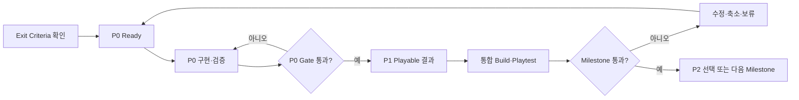
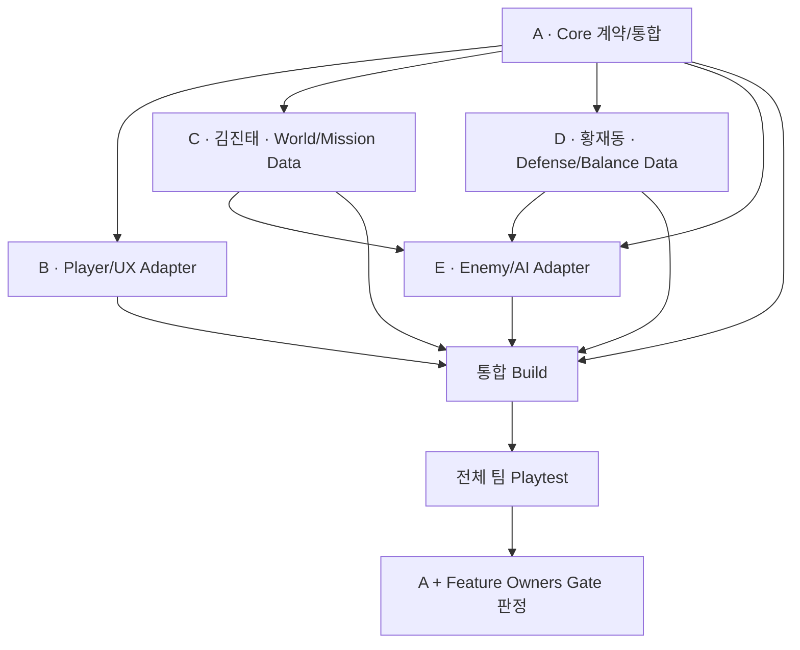

# Development Flow — 전체 개발 흐름

기준일: 2026-09-20
상태: 실행 순서 기준 / Sprint 1 Stage 1 PoC 실행 중

이 문서는 [milestones-and-core-design.md](milestones-and-core-design.md)의 M0~M5를 Sprint에서 실행하는 방법을 설명한다. Milestone 이름과 범위를 별도로 재정의하지 않는다.

현재 Sprint 1은 2026-10-02까지 Stage 1 PoC를 통합하는 time-box다. PoC 결과는 핵심 재미와 기술 위험을 판정하는 증거이며, 기존 M1/M2 Gate 통과와 프로덕션 이식을 자동 승인하지 않는다.

## 1. 전체 흐름

```text
제품 결정
→ M0 Baseline·Backlog 준비
→ M1 New Core Architecture Slice
→ M2 Single-player Product Vertical Slice
→ M3 2-player Co-op MVP
→ M4 Online Expansion·Content Alpha
→ M5 Beta·Release
```

각 Milestone 내부 흐름은 같다.



## 2. Milestone 요약

| 단계 | 먼저 증명할 것 | Playable 결과 | 다음 단계로 가는 증거 |
| --- | --- | --- | --- |
| M0 | 팀 기준·CI·Backlog가 실행 가능한가 | 안정적인 Baseline | P0 완료, 역할/범위 승인 |
| M1 | 레거시 없이 Core 계약이 작동하는가 | Minimal Test Scene | EditMode/Scene Test와 Core Gate |
| M2 | 게임의 고유한 재미가 있는가 | 15~20분 Single Vertical Slice | 외부 Playtest 지표 |
| M3 | 같은 규칙으로 2인이 안정적으로 하는가 | Invite 기반 Co-op | 2 Client 반복 완주·일관성 |
| M4 | Content·Online·Backend를 반복 운영할 수 있는가 | Alpha | 전체 Flow·복구·Pipeline 검증 |
| M5 | 출시해도 되는가 | Release Candidate | Clean Install·QA·License·운영 검증 |

## 3. 역할 간 선행 관계



- A는 공용 계약과 통합 지점을 먼저 제공하되 Feature를 대신 구현하지 않는다.
- B/C/D/E는 계약이 완벽해질 때까지 기다리지 않고 Fake/Interface로 최소 Slice를 병렬 검증한다.
- C와 D는 각각 김진태, 황재동이 담당하며, 자신의 Slice를 Fake/Interface로 병렬 검증한다.
- Feature끼리 직접 참조를 늘리지 않고 Definition, Command, Event, Adapter로 연결한다.

## 4. Sprint Planning

1. 현재 Milestone Exit Criteria와 최신 Build를 확인한다.
2. 가장 큰 Risk 하나를 Sprint Goal로 변환한다.
3. 미완료 P0를 먼저 Ready 상태로 만든다.
4. 팀원별 핵심 Task 1개와 작은 Task 1개 이하를 배정한다.
5. 예상 시간 합계는 실제 가용 시간의 70%를 넘지 않는다.
6. 모든 Task에 실명 Owner, 지원자와 가용 시간이 있는지 확인한다.
7. Test Evidence와 통합 날짜를 Task에 적는다.

## 5. 구현과 통합

### 5.1 작은 Slice

한 Slice는 가능한 한 아래 흐름을 끝까지 포함한다.

```text
Definition/Config
→ Domain rule
→ Command/Event
→ Unity Adapter/Presenter
→ Test Scene 또는 통합 Scene
→ 자동/수동 Test Evidence
```

Domain만 대량 작성하거나 Scene만 먼저 완성하는 방식은 피한다.

### 5.2 중간 통합

- Sprint 중간에 완료된 P0/P1을 `main`에 합친다.
- 같은 Build에서 Feature 간 상태·Scene·Save 연결을 확인한다.
- Goal과 무관한 작업은 P3 Backlog로 이동한다.
- 남은 시간으로 Exit Criteria를 달성할 수 없으면 범위를 줄인다.

### 5.3 PR과 Review

```text
Ready
→ Branch
→ 구현·Local Test
→ Self-review
→ PR + Evidence
→ CI
→ 필요 시 관련 Owner Review
→ Merge
→ 통합 Build
→ Verify
→ Done
```

GitHub Required Approval은 0이다. Core/Save/Scene/Build/Network처럼 영향이 큰 변경만 관련 Owner Review를 운영상 요구한다.

## 6. Playtest와 Gate 판정

### 매주

- Release Captain이 동일한 Build와 Test 순서를 준비한다.
- 각 Owner는 자신이 만들지 않은 기능 하나 이상을 확인한다.
- Bug는 재현 순서, 기대/실제 결과, Build/Commit을 남긴다.
- 다음 Build의 Blocker는 최대 3개로 제한한다.

### Milestone 종료

- A가 Exit Criteria 증거를 모은다.
- 각 Feature Owner가 자신의 영역을 통과/미통과로 판정한다.
- 미통과 항목은 수정, 범위 축소, P3 보류 중 하나로 결정한다.
- 모든 P0가 통과하고 핵심 Playable 결과가 있어야 다음 Milestone으로 이동한다.

## 7. 단계별 역할 초점

| Milestone | A | B | C | D | E |
| --- | --- | --- | --- | --- | --- |
| M0 | 범위·Architecture·CI | Player/HUD 분석 | World/Hub 설계 | Turret/Power 설계 | Enemy/Wave 분석 |
| M1 | New Core·Profile·Match | Player Adapter·HUD | Definition·Test World | Defense Rule/Data | Enemy/Director 최소 Slice |
| M2 | 왕복·Meta UI·통합 | Player Combat·Tutorial | Planet/Hub/Expansion | 3 Turret·Power·Growth | 3 Enemy·Boss·Wave |
| M3 | Steam/Authority/Network | Co-op UX | Ally Agent·Mission | Co-op Balance | Network-safe AI/Encounter |
| M4 | Backend·운영·Alpha Gate | Online UX·Polish | Content Pipeline | Progression/Balance Pipeline | Encounter Pipeline |
| M5 | Release·복구·승인 | UX/접근성 QA | Scene/Content QA | Economy/Balance QA | AI/Performance QA |

Priority별 상세 업무는 Core Design 문서를 사용한다.

## 8. 변경 결정

1. 해결할 Player/기술 문제를 기록한다.
2. 현재 Milestone과 Priority를 판정한다.
3. 추가 작업과 대신 제거·연기할 작업을 함께 적는다.
4. Prototype/Test/Playtest 방법을 정한다.
5. A가 채택·실험·보류·거절을 결정한다.
6. 제품 범위면 Project Plan, 기술 Gate면 Core Design, 역할이면 Role Ownership을 갱신한다.
7. 승인 후에만 Backlog Task를 만든다.

## 9. 지금 실행할 순서

1. [SPRINT_1_STAGE_1_POC.md](SPRINT_1_STAGE_1_POC.md)의 업무를 GitHub Issue로 만들고 담당자·완료 조건·검증 방법을 기록한다.
2. D가 터렛 인스턴스와 평가 데이터를 제공하고 E와 인터페이스를 합의한다.
3. E가 터렛 점수 기반 brute-force 목표 선택을 구현하고 필요 시 region 방식과 비교한다.
4. C가 거점 확보·상실과 전선 확장 Graybox를 E/D 결과에 연결한다.
5. B가 Netcode/RPC/권한 구조 조사 결과와 현재 PoC의 향후 네트워크 전환 위험을 공유한다.
6. A가 Player 지원 행동과 임시 승패 조건을 정해 한 Build로 통합한다.
7. 2026-10-02 전체 팀 플레이 테스트 뒤 2026-10-03 회의에서 재미, 문제점, 프로덕션 이식 여부를 판정한다.
8. PoC 동안 최종 아트, 모든 Content, 실시간 협동과 장기 성장 확정은 시작하지 않는다.
