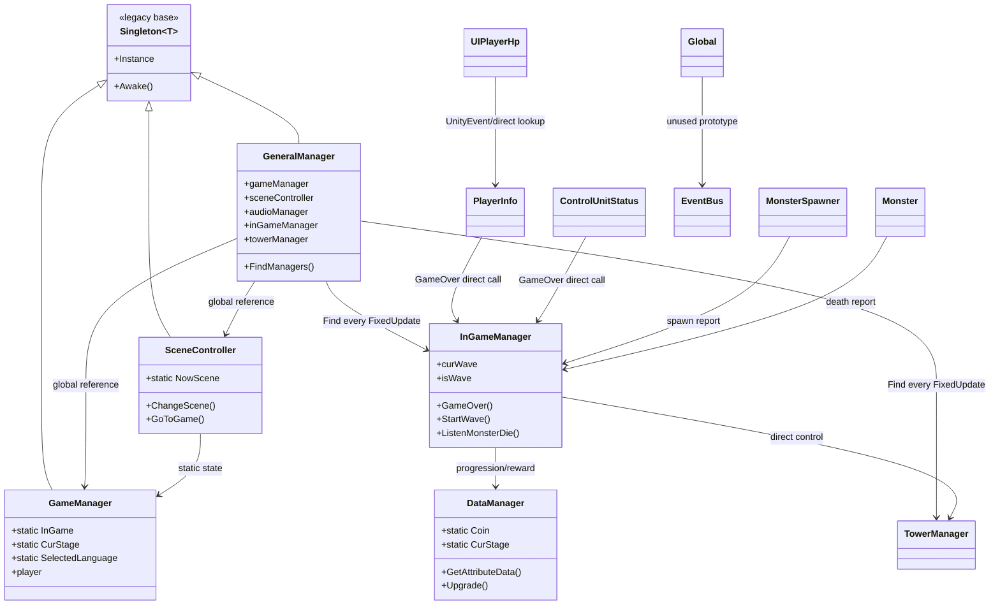
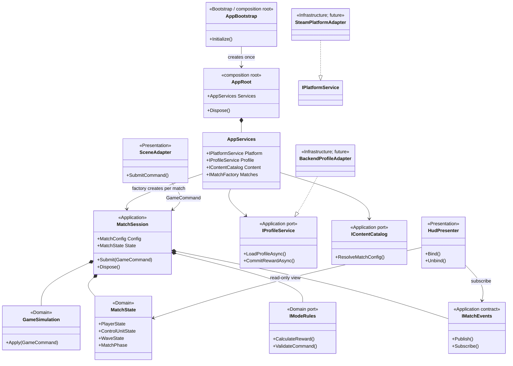

# Legacy Baseline and Target Architecture

작성일: 2026-09-07
수정일: 2026-09-11
상태: 레거시 분석·이식 대응 참고 자료

## 목적

Unity 6 및 Steam 출시를 목표로, 기존 동작을 한 번에 재작성하지 않으면서도 다음 문제를 제거한다.

- 전역 Singleton과 static 상태 때문에 테스트 씬이 Main 씬의 오브젝트 및 이전 실행 상태에 의존한다.
- `GeneralManager`가 씬 로컬 오브젝트를 매 프레임 이름으로 탐색하고, 게임플레이 코드가 이를 전역으로 직접 호출한다.
- `InGameManager`가 웨이브, 대화, UI, 보상, 일시정지, 게임오버를 한꺼번에 소유한다.
- 게임 상태 변경이 UI·사운드·연출로 직접 전달되어 변경 범위가 넓다.

이 문서는 레거시를 재사용의 기반이 아니라 **행동·수치·연출의 레퍼런스**로 기록한다.
목표 아키텍처는 `Domain / Application / Infrastructure / Presentation / Bootstrap`의
가벼운 Clean Architecture 용어를 사용한다. 이 문서는 Milestone이나 최종 이름을 결정하지 않는다.
명명은 [naming-and-architecture-conventions.md](naming-and-architecture-conventions.md), 순서는 [milestones-and-core-design.md](../planning/milestones-and-core-design.md)를 따른다.

## 현재 구조와 의존성

```text
Persistent legacy objects (Main)
  GeneralManager ─┬─ GameManager / SceneController / AudioManager
                  └─ scene-local manager references (Find every FixedUpdate)

Stage scene
  InGameManager ─┬─ Wave + Spawner + Dialogue + Pause + Reward + GameOver
                 ├─ TowerManager / ControlUnitStatus
                 └─ Player / MonsterSpawner / UI
```



현재의 핵심 문제는 화살표가 UI/Player/Monster에서 상위 Manager로 향한다는 점이다.
`GeneralManager`가 Service Locator가 되고, `InGameManager`가 게임 규칙과 표현을 함께 가진다.
`Global/EventBus` 초안은 이 그래프에 아직 연결되어 있지 않다.

## 목표 구조와 의존성



목표에서는 의존성이 바깥쪽(Unity, Steam, Backend, UI)에서 안쪽 계약으로만 향한다.
`GameSimulation`과 `MatchState`는 Unity/Steam/HTTP 타입을 알지 못한다.

`Assets/Scripts/System/Core`의 `Global`, `GlobalServices`, `EventBus`와
`System/Game`의 `Game`, `RunState`는 새 설계의 출발점이지만 아직 실제 레거시
흐름과 연결되어 있지 않다. `Global`은 씬 이벤트를 구독하지 않고, `EnsureGame()`도
호출되지 않는다. `EventBus`의 Publish/Subscribe 호출처도 없다.

## Singleton 때문에 씬 단위 테스트가 어려운 이유

현재 `Singleton<T>.Instance`는 호출 시 다음을 수행한다.

1. 현재 로드된 씬에서 `FindFirstObjectByType<T>()`를 찾는다.
2. 없으면 런타임 GameObject를 만들고 `DontDestroyOnLoad` 한다.
3. 이후 테스트 씬에서도 그 인스턴스와 static 필드가 남는다.

따라서 테스트 씬은 어떤 매니저가 이미 생성됐는지, Main 씬을 거쳤는지,
`DataManager`/`GameManager` static 값이 무엇인지에 따라 결과가 달라진다.
또한 AudioManager처럼 Inspector 설정이 필요한 Singleton은 자동 생성 인스턴스가
정상 설정을 갖지 않아 실패할 수 있다.

### 결론: Singleton을 서비스 주입으로 대체한다

Singleton을 전부 즉시 삭제할 필요는 없다. 새 코드에서 `X.Instance` 접근을 금지하고,
**명시적으로 생성되는 컨텍스트를 필요한 객체에 주입**한다. 그러면 테스트는 Main 씬을
열지 않고도 필요한 가짜 구현만 만들어 실행할 수 있다.

```text
AppRoot (프로세스당 1개; composition root)
  ├─ AppServices: Platform, Profile, Content, SceneFlow, MatchFactory
  └─ MatchSession (스테이지/던전/협동 매치마다 1개)
       ├─ MatchState
       ├─ WaveService / RewardService / PauseService
       ├─ IMatchEvents
       └─ scene adapters: PlayerPresenter, HudPresenter, SpawnerAdapter
```

여기서 `AppRoot`은 Singleton처럼 보일 수 있으나, 중요한 차이는 게임플레이 코드가
`AppRoot.Instance`를 조회하지 않는다는 점이다. 오직 부트스트랩만 AppRoot을 만들고,
나머지는 생성자·`Initialize(...)`·Inspector reference를 통해 필요한 최소 인터페이스만 받는다.

## 수명주기와 책임

| 스코프 | 생성/파기 | 예시 | 테스트 방식 |
| --- | --- | --- | --- |
| App | 앱 시작~종료 | 저장, 설정, 오디오, SceneLoader | 순수 C# 서비스 + Fake 구현 |
| MatchSession | 스테이지/던전/협동 매치 진입~이탈 | MatchState, 웨이브, 보상, 승패 | 순수 C# 단위 테스트 |
| Scene | 현재 씬 | Player 입력/물리, 스포너, HUD | PlayMode 씬 테스트 |
| View | UI 표시 중 | 팝업, 툴팁, 체력바 | Presenter 단위/PlayMode 테스트 |

`DontDestroyOnLoad`는 App 스코프의 `AppRoot` 하나에만 허용한다. MatchSession과
씬 오브젝트는 반드시 씬 이탈 시 폐기한다.

## 레거시 → 목표 대응표

| 레거시 클래스/책임 | 목표 클래스/계층 | 이식 방식 |
| --- | --- | --- |
| `GlobalBootstrap`, `Global` | `AppBootstrap`, `AppRoot` | 유지·정리. AppRoot는 조립만 하며 게임 규칙을 갖지 않는다. |
| `GlobalServices` | `AppServices` | 서비스 집합은 Bootstrap 내부에서만 사용한다. 게임플레이의 전역 조회를 금지한다. |
| `GameManager` | `AppState`, `PlayerProfile`, `MatchState` | static 플래그/진행도/런타임 상태를 수명주기별 모델로 분해한다. |
| `SceneController` | `SceneFlowController` | 씬 전환만 담당. 웨이브/보상/게임 규칙을 호출하지 않는다. |
| `DataManager` | `ContentCatalog`, `PlayerProfile`, `ProfileService` | 밸런스 정의, 계정 진행도, Backend Gateway와 Local Cache를 분리한다. |
| `InGameManager` | `MatchSession`, `GameSimulation`, `StoryModeRules` | 웨이브·승패·보상을 Domain/Application으로 이식한다. UI/Animator는 Presenter로 이동한다. |
| `PlayerInfo` | `PlayerState` + `PlayerSceneAdapter` | HP 원본은 State, MonoBehaviour는 피격/표현 Adapter가 된다. |
| `ControlUnitStatus` | `ControlUnitState` + `ControlUnitSceneAdapter` | HP/전력 원본을 State로 이동한다. |
| `UIPlayerHp`, `UICUInfo` | `HudPresenter` + View | State/event 구독으로 갱신하고 Player/Manager 검색을 제거한다. |
| `MonsterSpawner`, `Monster` | `SpawnerSceneAdapter`, `MonsterSceneAdapter` | spawn/death를 `GameCommand`/result로 보고한다. |
| `TowerManager` | `TowerSystem` + `TowerSceneAdapter` | 미리 배치된 터렛의 활성화/전력 규칙은 System, 선택 메뉴/프리팹은 Presentation으로 분리한다. 플레이어 건설 기능은 포함하지 않는다. |
| `AudioManager` | `IAudioService` + `UnityAudioAdapter` | Game event를 표현하되, Domain에 직접 참조되지 않는다. |

이 표는 상속 계보가 아니라 **책임의 이식 지도**다. 레거시 클래스를 새 이름으로 바꿔
상속하는 것이 아니라, 필요한 행동을 새 계층의 계약으로 다시 구현한다.

## 권장 인터페이스 경계

처음부터 범용 Service Locator를 만들지 않는다. 의존성은 구체적으로 드러낸다.

```csharp
public interface IAudioService
{
    void PlaySfx(SfxId id);
    void PlayMusic(MusicId id);
}

public interface ISceneLoader
{
    void Load(SceneId id);
}

public interface IMatchEvents
{
    IDisposable Subscribe<T>(Action<T> handler);
    void Publish<T>(T evt);
}
```

`WaveService`는 `IMatchEvents`에 `WaveStarted`, `MonsterSpawned`, `MonsterDefeated`,
`WaveCompleted`, `MatchCompleted`를 발행한다. `HudPresenter`, `AudioPresenter`,
`SpawnerAdapter`가 이를 구독한다. 서비스는 `GameObject`, `TMP_Text`, Animator,
`GeneralManager`를 알지 못한다.

## 상태 변경 규칙

- 상태는 `MatchState` 같은 모델이 소유한다. public field를 직접 쓰지 않는다.
- 상태 변경 메서드는 값이 실제로 바뀔 때만 이벤트를 한 번 발행한다.
- UI는 상태를 폴링하지 않는다. 예: Player HP는 매 `FixedUpdate` 이벤트 발행 대신
  `ApplyDamage`/`Recover`에서 `PlayerHealthChanged`를 발행한다.
- `IDisposable` 구독 토큰은 View의 `OnEnable`/`OnDisable` 또는 Session의
  생성/Dispose에서 확실히 해제한다.
- 이벤트 버스는 상태 저장소가 아니다. 현재 상태를 읽을 API는 별도로 둔다.

## 레거시에서 새 구조로의 단계적 이관

### 0. 안전망

- `DataManager`의 ControlUnit Power/Health 배열 인덱스 역전 및 미사일 기본값 불일치를 고친다.
- `GameManager`, `DataManager`의 static 상태를 테스트 시작마다 초기화할 수 있는 임시 리셋 도구를 둔다.
- `GeneralManager.FixedUpdate`의 반복 Find 의존성을 더 늘리지 않는다.

### 1. M2에서 MatchSession을 레거시 Scene에 연결

- 새 `AppBootstrap`만 `AppRoot` 하나를 생성한다. `GlobalBootstrap`은 참고 대상으로만 둔다.
- 씬 로드 이벤트에서 Match 씬이면 `MatchSession`을 생성하고, 이탈 시 `Dispose()` 한다.
- 기존 `InGameManager`는 당분간 Scene Adapter가 되어 Session을 생성/참조만 한다.

### 2. HP/CU/웨이브를 첫 vertical slice로 이관

- PlayerInfo와 ControlUnitStatus의 수치를 `MatchState`의 분리된 상태 모델로 이관한다.
- UIPlayerHp/UICUInfo는 이벤트를 구독하는 Presenter로 변경한다.
- MonsterSpawner와 Monster는 직접 `InGameManager.Listen...`을 호출하지 않고
  Spawn/Death 이벤트를 발행한다.
- WaveService가 카운터와 승패를 단독 소유한다.

### 3. InGameManager 분해

- `PauseService`: 상태와 입력 허용 여부.
- `WaveService`: 웨이브 전이와 스폰 완료/처치 수.
- `StageFlowService`: 대화, 다음 웨이브, 승패 전이.
- `RewardService`: 보상 산정과 진행도 저장 요청.
- UI 및 Animator 조작은 각 Presenter/Controller로 이동.

### 4. 영속 데이터와 Steam 준비

- ScriptableObject: 밸런스 정의, StageDefinition, WaveDefinition, 대사/로컬라이즈 키.
- Profile 데이터: 해금, 코인, 업그레이드, 언어, 옵션, 키 바인딩.
- Backend-authoritative `IProfileService`와 별도의 versioned local binary cache 계약을 둔다.
- Steam Cloud를 사용하더라도 cache 배포 수단으로 취급하며 Backend 권한 저장소를 대체하지 않는다.
- 저장 데이터에는 버전 번호와 마이그레이션을 둔다.

## 테스트 전략

### 순수 C# EditMode 테스트

Unity 씬 없이 `WaveService`, `RewardService`, `MatchState`를 테스트한다.

```csharp
[Test]
public void FinalWave_WhenAllSpawnedMonstersDie_EndsRun()
{
    var events = new EventBus();
    var state = new MatchState();
    var wave = new WaveService(state, events, new FakeStageDefinition(...));

    wave.Start();
    // spawned/dead 이벤트 또는 명시 메서드 호출
    Assert.That(state.Result, Is.EqualTo(RunResult.Cleared));
}
```

### PlayMode 씬 테스트

Stage_1과 별개인 작은 TestStage에 `MatchSessionBootstrap`, Player prefab,
FakeAudioService, FakeSceneLoader만 배치한다. Main, GeneralManager,
실제 AudioManager를 로드하지 않는다.

### 전환 기간의 임시 원칙

- 새 시스템 테스트에서 `*.Instance`를 호출하면 실패하게 한다.
- 레거시 어댑터에서만 Singleton 접근을 허용한다.
- 테스트 사이 static reset은 임시 안전장치일 뿐, 설계의 최종 해법은 아니다.

## 남은 Migration 질문

아래는 다른 기준 문서에서 아직 결정하지 않은 레거시 이식 세부사항이다.

1. 신규 Input System과 기존 입력의 전환 순서
2. UI Toolkit과 UGUI의 유지 범위
3. 기존 Audio/Dialogue를 어떤 M2 Architecture Slice에서 이식할지
4. 레거시 Scene Adapter를 제거할 정확한 Retirement 조건

## 현재 코드에서 확인한 주요 위험

- `GeneralManager`가 물리 프레임마다 `GameObject.Find`로 로컬 매니저와 UI를 찾는다.
- `InGameManager`가 약 840줄로 다수 도메인 책임을 가진다.
- `DataManager.ApplyLevelingSystem()`의 ControlUnit Power/Health 배열 인덱스는 `AttributeType`과 불일치한다.
- 미사일 기본 공격력은 초기 배열 `120`, 레벨 적용 기준값 `110`으로 불일치한다.
- `PlayerInfo`는 변경 여부와 무관하게 매 FixedUpdate에 HP 이벤트를 발행한다.
- 현재 EventBus/Global/Game 초안은 실행 흐름에 연결되지 않았다.
