# Turret System Guide

작성일: 2026-09-24
최종 갱신: 2026-09-30
상태: Sprint 1 전환기 구현 가이드 / Canon·Missile 기준

[문서 목차](../README.md) · [코드·아키텍처 명명 규칙](naming-and-architecture-conventions.md) · [System Re-architecture Charter](system-rearchitecture-charter.md) · [Sprint 1 Stage 1 PoC](../planning/SPRINT_1_STAGE_1_POC.md)

## 1. 문서 목적과 적용 범위

이 문서는 현재 Canon Turret과 Missile Turret의 데이터 구조, 실행 흐름, Prefab 설정법과 확장 규칙을 설명한다. 터렛 코드를 수정하거나 AI·전력·업그레이드 시스템에서 터렛 정보를 사용할 때 먼저 확인한다.

이 문서는 현재 구현을 설명하는 **전환기 가이드**다. 제품 규칙이나 New Core의 최종 계약을 새로 확정하지 않는다. 게임 범위와 장기 구조가 충돌하면 [System Re-architecture Charter](system-rearchitecture-charter.md)와 [Docs Source of Truth](../README.md#source-of-truth)가 우선한다.

현재 적용 범위는 다음과 같다.

- Canon Turret LV1~LV3, Stage 1~3
- Missile Turret LV1~LV3, Stage 1~3
- `TurretDefinition`, `TurretRuntimeState`, `TurretBase`
- 로컬 런타임 등록을 위한 `TurretInstanceRegistry`
- AI와 전선 소비자를 위한 읽기 전용 `TurretSnapshot`
- 터렛 체력·파괴·플레이어 복구 흐름
- 인스턴스별 Damage/Power 보정과 Stage 1 프리팹 교체 방식의 레벨 승급
- Enemy PoC의 `PoCTargetable` 연결
- `TowerBullet`, `TowerMissile`로 전달되는 공격력

다음 항목은 이 문서의 현재 적용 범위가 아니다.

- Laser Turret 이식
- 파괴 연출과 복구 비용·시간의 최종 게임 규칙
- 승급 비용·시간과 Spaceship Research 연동
- NGO를 통한 `InstanceId`와 상태 동기화
- AI 평가값·위협도·전선 정보를 집계하는 정식 Turret Manager

## 2. 핵심 원칙

터렛 데이터는 다음 세 종류로 나눈다.

| 종류 | 의미 | 저장 위치 | 예시 |
| --- | --- | --- | --- |
| Definition | 실행 중 원본을 바꾸지 않는 콘텐츠·밸런스 값 | `TurretDefinition` ScriptableObject | 사거리, 기본 공격력, 최대 체력, 전력, 발사 속도 |
| Runtime State | 터렛 인스턴스마다 실행 중 바뀌는 값 | `TurretRuntimeState` | 자동 발급 ID, 활성 상태, 현재 체력, 파괴 여부, 업그레이드 보정값 |
| Behavior-local State | 공격 동작 내부에서만 필요한 짧은 상태 | Canon/Missile 구현체 | 현재 Target, 발사 타이머, 현재 미사일 과열 수치 |

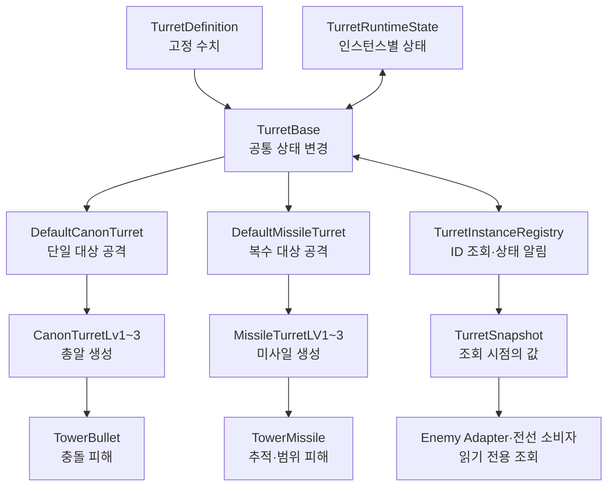

Definition 값을 실행 중 상태 저장소처럼 직접 수정하지 않는다. 반대로 Target, 활성 상태, 과열 진행도처럼 매번 달라지는 값은 Definition에 넣지 않는다.

## 3. 주요 타입과 책임

### 3.1 `TurretDefinition`

파일: [`TurretDefinition.cs`](../../Assets/Scripts/Tower/Turret/Core/TurretDefinition.cs)

Stage와 Level별 터렛 Prefab이 참조하는 ScriptableObject다. 현재 18개 Canon/Missile Definition이 존재한다.

| 필드 | 의미 | 작성 규칙 |
| --- | --- | --- |
| `Id` | Definition을 식별하는 고유 ID | 소문자 `snake_case`, 중복 금지 |
| `DisplayName` | UI에 표시할 이름 | 사람이 읽을 수 있는 이름 |
| `Level` | 터렛 레벨 | 1 이상 |
| `Damage` | 발사체에 전달할 기본 공격력 | 0 이상 |
| `Range` | 적 탐색과 Gizmo에 쓰는 실제 사거리 | 0 이상 |
| `RotationSpeed` | 포신 회전 속도 | 0 이상 |
| `TargetingAngle` | 발사를 허용하는 조준 오차 | Canon 10°, Missile 360° |
| `FireRate` | 초당 발사 횟수 | 0보다 커야 함 |
| `MaxHealth` | 터렛의 최대 체력 | 1 이상 |
| `Power` | 활성화할 때 필요한 전력 | 0 이상 |
| `OverHeatTime` | Canon 연속 사격 과열 기준 | 초 단위 |
| `OverHeatMissileCount` | Missile 과열 기준 발사 횟수 | Canon에서는 0 |
| `CoolTime` | Canon/Missile 과열 후 냉각 시간 | 초 단위 |

예시 ID는 `canon_stage1_lv1`, `missile_stage3_lv2`다. `Id`는 저장·조회용이고 `DisplayName`은 UI용이므로 서로 대신 사용하지 않는다.

Editor에서 Definition을 수정하면 전체 `TurretDefinition`을 검사한다. ID가 비었거나 서로 다른 에셋이 같은 ID를 사용하면 Console에 오류가 표시된다.

### 3.2 `TurretRuntimeState`

파일: [`TurretRuntimeState.cs`](../../Assets/Scripts/Tower/Turret/Core/TurretRuntimeState.cs)

각 터렛 GameObject가 독립적으로 가지는 실행 중 상태다.

| 상태 | 설명 | 변경 방법 |
| --- | --- | --- |
| `InstanceId` | 현재 실행에서 터렛 한 개를 식별 | Registry가 자동 발급 |
| `IsActivated` | 사용자가 켜서 전력을 예약한 상태인지 표시 | `RequestActivation` |
| `IsOperational` | 활성화됐고 과열·파괴·잠금 상태가 아닌지 표시 | 활성화·과열·파괴·잠금 흐름에서 자동 계산 |
| `IsLocked` | 해당 인스턴스를 켤 수 없는 상태 | `SetLocked` |
| `CurrentHealth` | 현재 남아 있는 체력 | `ApplyDamage`, `Restore` |
| `IsDestroyed` | 체력 0으로 파괴됐는지 표시 | `ApplyDamage`, `Restore` |
| `DamageBonus` | 수동 보너스와 적용된 업그레이드의 공격력 보정 합 | `SetDamageBonus`, `AddDamageBonus`, `ApplyUpgrade` |
| `PowerBonus` | 적용된 업그레이드의 실행 중 전력 보정 | `ApplyUpgrade` |
| `RangeModifierRatio` | 기본 사거리에 더할 비율 보정의 합 | `ApplyUpgrade` |

Prefab의 `_instanceId` 기본값 `0`은 **미할당**을 뜻한다. Inspector에서 ID를 수동으로 정하지 않는다. 실제 ID는 Play Mode에서 등록될 때 양수로 자동 발급된다.

최종 공격력은 다음 규칙을 사용한다.

```text
Final Damage = max(0, Definition.Damage + RuntimeState.DamageBonus)
Effective Power = max(0, Definition.Power + RuntimeState.PowerBonus)
Effective Range = max(0, Definition.Range × (1 + RuntimeState.RangeModifierRatio))
```

영구 연구 수치를 Definition에 덮어쓰지 않는다. Profile/Research 결과를 Match 시작 시 런타임 보너스로 변환하는 Adapter가 이후 필요하다.

### 3.3 `TurretBase`

파일: [`TurretBase.cs`](../../Assets/Scripts/Tower/Turret/Core/TurretBase.cs)

Canon과 Missile이 공통으로 사용하는 Unity 표현 계층의 작은 base class다. 공통 Scene 참조와 Definition/RuntimeState 접근을 제공한다.

주요 책임은 다음과 같다.

- 포신, 회전 지점, Animator, SpriteRenderer, LayerMask 참조 보관
- Definition의 수치를 읽기 전용 property로 제공
- 활성화·전력 예약의 단일 요청 API 제공
- 잠금·해금과 활성화 거부 처리
- 체력 감소, 파괴, 복구 API 제공
- 최종 공격력 계산
- `OnEnable`/`OnDisable`에서 Registry 등록·해제

`TurretBase`에 새 밸런스 값을 직접 추가하기 전에 먼저 다음을 판단한다.

1. 모든 인스턴스가 공유하는 고정 값이면 `TurretDefinition`
2. 인스턴스마다 실행 중 바뀌며 여러 시스템이 읽어야 하면 `TurretRuntimeState`
3. 한 공격 방식 내부에서만 잠깐 필요하면 Canon/Missile 구현체의 private field

### 3.4 `TurretInstanceRegistry`

파일: [`TurretInstanceRegistry.cs`](../../Assets/Scripts/Tower/Turret/Core/TurretInstanceRegistry.cs)

씬에 존재하는 터렛에 로컬 `InstanceId`를 발급한다. AI와 전선 등 읽기 전용 소비자는 컴포넌트 대신 조회 시점의 값만 복사한 [`TurretSnapshot`](../../Assets/Scripts/Tower/Turret/Core/TurretSnapshot.cs)을 받는다. 스냅샷에는 `InstanceId`, Definition ID, 월드 위치, 활성·작동·파괴·잠금 상태, 현재·최대 체력, 유효 공격력, 실제 사거리와 유효 전력 비용이 들어 있다. `TurretBase`, `TurretRuntimeState`, `TurretDefinition` 참조는 들어 있지 않다.

```csharp
if (TurretInstanceRegistry.TryGetSnapshot(instanceId, out TurretSnapshot snapshot))
{
    Debug.Log($"{snapshot.DefinitionId}: {snapshot.CurrentHealth}/{snapshot.MaxHealth}");
}
```

`GetAllSnapshots()`, `GetActiveSnapshots()`, `GetOperationalSnapshots()`는 각각 전체·활성·작동 가능한 터렛의 읽기 전용 목록을 반환한다. 각 호출 결과는 그 순간의 복사본이며, 보관한 스냅샷은 터렛이 이동하거나 상태가 바뀌어도 자동 갱신되지 않는다. 이동 중 위치가 필요하면 원하는 주기에 ID로 다시 조회한다.

Prefab 안의 Adapter처럼 자신의 `Transform`만 아는 소비자는 `TryGetInstanceId(transform, out int instanceId)`로 부모 터렛의 ID를 얻은 뒤 단건 조회를 사용할 수 있다. 이 보조 메서드도 터렛 컴포넌트를 반환하지 않는다.

`SnapshotChanged(int instanceId)`는 등록·해제·활성화·작동 상태·체력·파괴·복구·잠금·공격력 보너스·세부 업그레이드·레벨 변경 후 발생한다. 이벤트에는 객체 참조를 싣지 않는다. 구독자는 같은 ID로 `TryGetSnapshot`을 다시 호출한다. 해제 후에는 조회가 실패한다. 레벨 변경은 프리팹이 바뀌어도 ID를 유지하므로 기존 `TurretBase` 참조 대신 ID로 새 값을 조회한다. 하나의 동작에서 상태가 여러 번 바뀌면 이벤트도 여러 번 발생할 수 있으므로 횟수에 의존하지 않는다.

기존 `TryGet`, `GetAll`, `GetActive`, `GetOperational` 및 `RegisteredInstances`는 기존 게임플레이·디버그 호출부의 호환을 위해 남아 있다. 이들은 `TurretBase`를 반환하므로 새 읽기 전용 소비자에게 사용하지 않는다. 터렛 상태 변경은 별도의 기존 요청 API를 사용한다.

같은 Definition 에셋을 여러 터렛 인스턴스가 사용하는 것은 정상이다. 오류가 되는 경우는 **서로 다른 Definition 에셋이 같은 `Definition.Id`를 사용하는 경우**다.

Registry는 현재 PoC용 로컬 등록부다. AI 조회용 상태 집계, 전력 총합, 구역별 터렛 관리까지 책임지는 정식 Manager가 아니다. `TowerManager`를 다른 이름의 전역 Singleton으로 다시 만드는 방식으로 확장하지 않는다.

파괴된 터렛은 Registry에 남아 복구할 수 있지만 Active/Operational 조회에서는 제외된다.

### 3.5 Assembly 경계

Turret의 독립 가능한 계약과 공통 구조는 다음 두 assembly로 분리한다.

| Assembly | 포함 범위 | 허용 의존성 |
| --- | --- | --- |
| `TeamHJD.Game.Turrets.Contracts` | `ITurretActivationRequester`, `ITurretPowerSource`, 활성화 결과 | .NET BCL만 |
| `TeamHJD.Game.Turrets` | Definition, RuntimeState, Base, InstanceRegistry, 활성화·탐색 공통 로직 | Contracts, Unity |

`Contracts`는 `noEngineReferences: true`를 유지한다. `Turrets`는 ScriptableObject와
MonoBehaviour를 포함하므로 Unity Engine을 참조한다. Canon/Missile/Laser concrete 구현은
`AudioManager`, `Monster` 등 legacy 코드 의존성이 남아 있어 현재 `Assembly-CSharp`에
유지한다. 새 assembly에서 legacy `Assembly-CSharp`를 역참조하도록 설정하지 않는다.

Assembly와 namespace는 `TeamHJD.Game.*` 표기를 사용한다. 새 reference를 추가할 때는
편의를 위해 양방향 참조를 만들지 말고 위 표의 단방향을 유지한다.

### 3.6 Canon과 Missile 구현체

| 타입 | 책임 |
| --- | --- |
| `DefaultCanonTurret` | 단일 Target 탐색, 포신 회전, 발사·과열·냉각, 활성화 표현 |
| `CanonTurretLv1~3` | Level별 발사구와 발사체 생성 |
| `DefaultMissileTurret` | 복수 Target 탐색, 포신 회전, 발사 횟수 기반 과열, 활성화 표현 |
| `MissileTurretLV1~3` | 발사구 수에 맞는 Target 배열과 미사일 생성 |
| `TowerBullet` | Canon이 계산한 공격력을 받아 충돌 대상에 적용 |
| `TowerMissile` | Missile이 계산한 공격력을 받아 폭발 범위 대상에 적용 |

Level 스크립트에서 `Damage = 10`처럼 밸런스 수치를 다시 하드코딩하지 않는다. 발사체를 생성한 직후 `Initialize(..., Damage)`로 Definition/RuntimeState에서 계산된 공격력을 전달한다. Canon은 발사 방향점 `Transform`을, Missile은 실제 몬스터 Target을 첫 번째 인자로 전달한다.

## 4. 실행 흐름

아래 흐름도는 **현재 Canon/Missile 구현의 실제 호출 경로**다. 상자는 클래스의 메서드 또는 변경되는 상태를 뜻한다. 실패 조건과 생략된 연출은 본문에서 따로 설명한다. Laser는 아직 이 경로를 사용하지 않는다.

### 4.1 생성과 등록

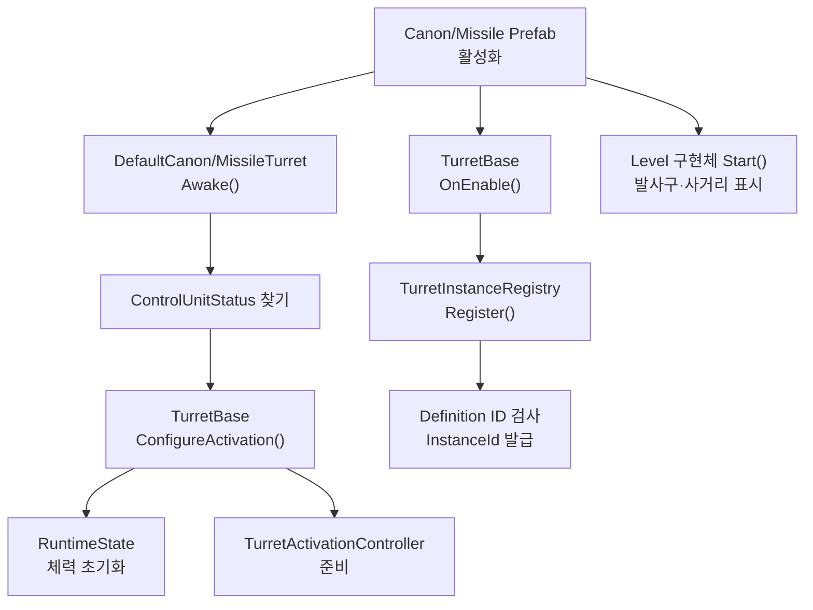

`Awake`에서 Definition 또는 ControlUnit 참조가 없으면 초기화에 실패하고 터렛 컴포넌트를 비활성화한다. `InstanceId`는 Prefab에 수동 입력하지 않고 Registry가 로컬 실행 중 발급한다.

### 4.2 활성화와 전력

켜기와 끄기는 같은 `RequestActivation(bool)` API를 사용한다. 가로로 넓어져 글자가 잘리지 않도록 결과 흐름을 나눠 표시한다.

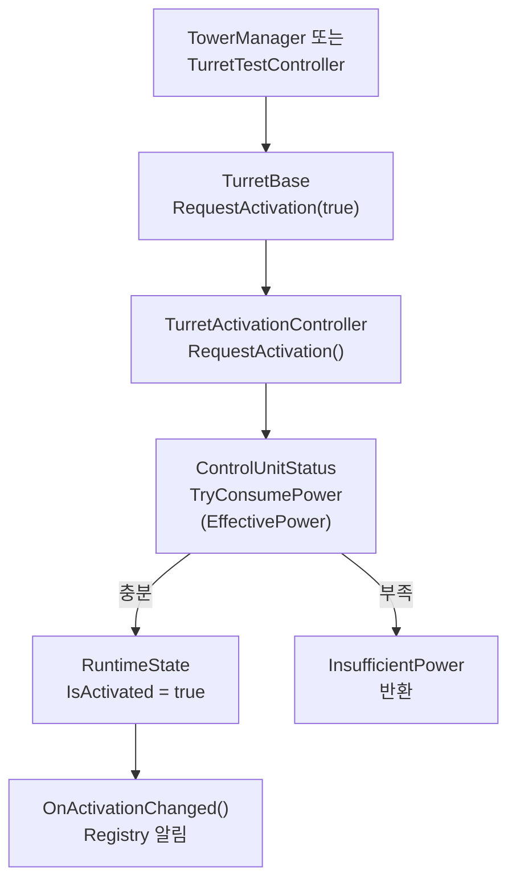

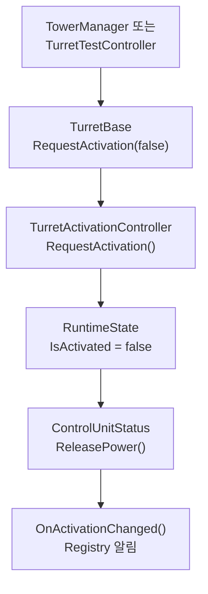

호출부는 전력을 먼저 검사한 다음 별도 활성화 메서드를 호출하지 않는다. 전력 확인과 상태
변경은 반드시 `RequestActivation` 한 경로에서 처리한다. 과열은 사용자가 끈 상태가 아니므로
`IsActivated`와 전력 예약을 유지하고 `IsOperational`만 일시적으로 `false`가 된다.
`ControlUnitStatus.ReleasePower`는 반환 전력을 0.1초에 1씩 회복한다. 반면 업그레이드로
전력 사용량이 감소할 때의 차액은 `TryChangeReservation`에서 즉시 반환한다.

### 4.3 체력, 파괴와 복구

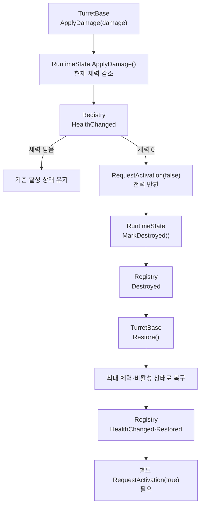

위 흐름의 파괴 시 전량 반환은 **현재 코드의 전환기 동작**이며 확정된 제품 규칙이 아니다. 2026-09-26 회의와 9월 27일 정리에 따라, 터렛 API는 파괴 시 예약 전력의 **손실률(0~100%)**을 설정값으로 받을 수 있어야 한다. 반환량은 `예약 전력 × (1 - 손실률 / 100)`으로 계산할 수 있게 한다. 예를 들어 예약 전력 100에서 손실률 0%면 100, 50%면 50을 반환한다. 값의 실제 설정, 반환 여부와 시점, 점유율에 미치는 영향은 아직 결정하지 않았다. API 입력값을 열어두는 요구와 현재 코드에 이 동작이 구현되었다는 주장을 구분한다.

파괴된 터렛은 Registry에서 즉시 제거하지 않는다. 플레이어가 같은 인스턴스를 복구할 수
있도록 등록 상태를 유지하되 Active/Operational 조회와 활성화 요청에서는 제외한다. Scene
전환이나 실제 GameObject 제거는 `Unregistered`로 구분한다. 현재 `TurretTestController`의 Damage·Destroy·Restore 버튼이 이 경로를 직접 호출한다. Enemy PoC의 타깃 어댑터는 조회용이며, 적의 공격을 `TurretBase.ApplyDamage()`에 전달하는 기능까지 뜻하지는 않는다.

### 4.4 탐색과 공격

`IsOperational`이 `true`일 때만 각 터렛의 `Update()`가 탐색·회전·발사·과열 확인을 수행한다. 실제 탐색은 `TurretTargetingUtility.CollectByDistance()`가 사거리 안의 `enemyMask` Collider를 거리순으로 모으는 방식이다.

#### Canon: 한 대상을 조준하고 직진 탄환으로 피해

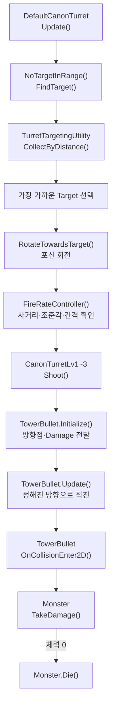

Canon 포신은 Target을 향해 돌지만, **발사된 `TowerBullet`은 몬스터를 추적하지 않는다.** `Initialize()` 때 발사 방향점으로 방향을 정한 뒤 직진하며, 충돌한 오브젝트에 `Monster`가 있으면 피해를 준다. Target이 죽거나 사거리를 벗어나면 다음 탐색에서 새 대상을 찾는다.

#### Missile: 복수 대상을 지정하고 유도·범위 피해

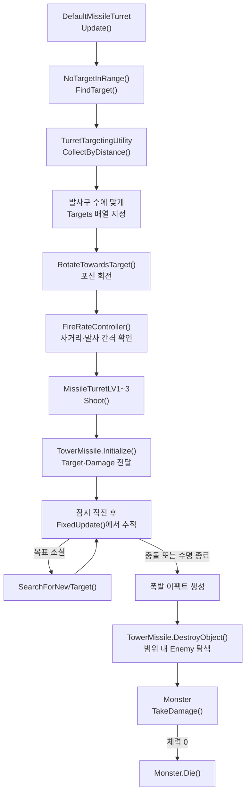

Missile은 적 수가 부족하면 첫 Target을 다른 발사 슬롯에서도 사용할 수 있다. **`Explode`는 시각·소리 연출이고, 실제 범위 피해는 `TowerMissile.DestroyObject()`에서 적용한다.** 두 공격 방식 모두 발사체 생성 시 `Damage = max(0, Definition.Damage + RuntimeState.DamageBonus)`를 전달한다.

### 4.5 과열과 냉각

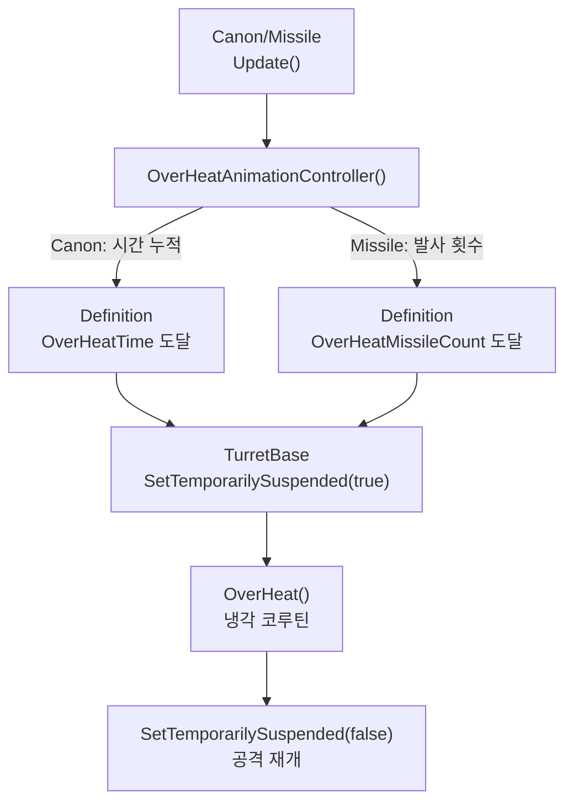

과열 중에는 `IsActivated`와 예약 전력을 유지하지만 `IsOperational`만 `false`다. 따라서 수동 비활성화와 과열을 같은 상태로 취급하지 않는다. Missile은 `Shoot()` 호출마다 카운트가 1씩 증가하므로 한 번에 여러 발을 쏴도 발사 1회로 센다. 과열 기준은 `OverHeatMissileCount`, 과열 후 냉각 시간은 `CoolTime`이 정한다.

## 5. Prefab과 Definition 설정 방법

### 기존 수치 조정

1. 대상 Prefab이 참조하는 `_definition`을 확인한다.
2. 해당 `TurretDefinition` 에셋에서 수치를 수정한다.
3. 같은 Level이라도 Stage별 Definition이 다르므로 수정 범위를 확인한다.
4. `Id`는 참조 키이므로 밸런스 조정만으로 변경하지 않는다.
5. Prefab의 발사구와 시각적 사거리 표시가 의도대로 동작하는지 `TurretTest` Scene에서 확인한다.

### 새 Canon/Missile 변형 추가

1. 가장 가까운 기존 Prefab과 Definition을 복제한다.
2. 새 Definition에 고유 `Id`, `DisplayName`, Level과 전투 수치를 입력한다.
3. Prefab의 `_definition`을 새 에셋으로 교체한다.
4. 발사구 배열과 방향 Transform을 확인한다.
5. `_runtimeState._instanceId`는 `0`으로 둔다.
6. Gizmo 사거리와 실제 적 탐지 범위를 비교한다.
7. 활성화·비활성화, 전력 부족, 과열·냉각, Target 사망 후 재탐색을 검증한다.
8. 체력 감소, 파괴, 복구 후 수동 재활성화를 검증한다.
9. 새 에셋과 `.meta` 파일을 함께 커밋한다.

### 사거리 표시

실제 탐지와 원형 Sprite는 모두 `EffectiveRange`를 사용한다. `TurretBase.RefreshRangeVisual()`은 Sprite의 월드 크기와 부모 Scale을 고려해 표시 원의 지름을 `EffectiveRange × 2`로 맞춘다. 세부 업그레이드로 사거리가 변하면 바로 다시 계산한다.

## 6. 업그레이드와 밸런스 규칙

- 기본 수치 조정: Definition 에셋 수정
- 한 판 동안 적용되는 강화·버프: `TurretUpgradeDefinition`을 선택한 인스턴스의 RuntimeState에 적용
- 계정 영구 성장: Profile/Research에서 보관하고 Match 시작 시 RuntimeState 또는 immutable `MatchConfig`로 변환
- 발사체: 자신이 생성될 때 받은 최종 공격력만 사용

`TurretUpgradeDefinition`은 업그레이드 ID, 표시 이름, 호환 가능한 `TurretDefinition.Id` 목록, Damage/Power 보정값과 기본 사거리 대비 비율 보정값을 가진다. 호환 목록이 비어 있으면 모든 터렛 Definition에 적용할 수 있다.

```csharp
TurretUpgradeResult result = turret.ApplyUpgrade(upgradeDefinition);
```

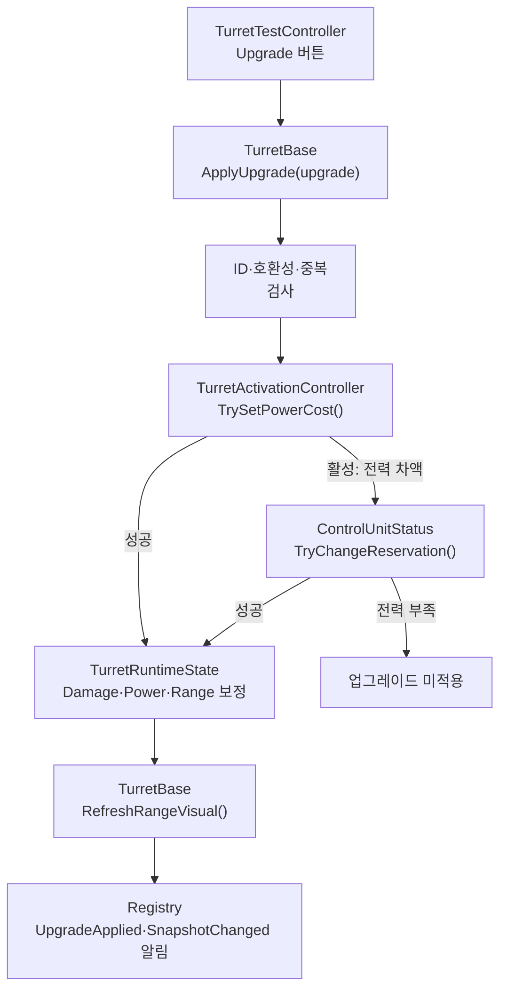

적용 규칙은 다음과 같다.

- 원본 `TurretDefinition` ScriptableObject는 수정하지 않는다.
- 보정값과 적용 이력은 선택한 `TurretRuntimeState`에만 저장된다.
- 같은 업그레이드 ID는 동일 인스턴스에 한 번만 적용된다.
- 활성 터렛의 Power가 증가하면 추가 전력을 즉시 예약한다. 전력이 부족하면 업그레이드 전체를 적용하지 않는다.
- Power가 감소하면 차액을 즉시 반환한다.
- 외부 조회에는 `EffectiveDamage`, `EffectivePower`, `EffectiveRange`를 사용한다.
- 적용 성공 시 `TurretInstanceRegistry.UpgradeApplied`가 발생하므로 AI·전선 Adapter가 값을 다시 읽을 수 있다.

현재 제공하는 샘플은 Canon과 Missile 각각의 `Low Power`(Damage -3 / Power -5 / Range +10%)와 `High Firepower`(Damage +6 / Power +8 / Range -10%)다. 테스트용 수치이며 실제 밸런스 확정값은 아니다. 두 업그레이드는 서로 배타적이지 않아 같은 인스턴스에 모두 적용할 수 있다. 사거리 비율은 더하는 방식이므로 둘 다 적용하면 사거리 보정은 0%다. 새 업그레이드는 에셋을 추가해 확장하며 기존 Canon/Missile 구현체에 조건문을 추가하지 않는다. 발사 속도 보정은 아직 없다.

### 6.1 레벨 승급과 다운그레이드

`TurretLevelUpgradeCatalog`은 현재 Definition과 양쪽 레벨의 프리팹을 연결한다. 현재 카탈로그에는 Stage 1 Canon/Missile의 LV1↔LV2, LV2↔LV3 경로만 등록되어 있다. `TurretTest`의 `Level Up`과 `Level Down` 버튼으로 확인할 수 있다. Stage 2·3은 양방향 경로를 카탈로그에 추가해야 한다.

```csharp
if (catalog.TryGetNext(turret.Definition, out TurretBase nextPrefab))
{
    TurretLevelUpgradeResult result =
        turret.RequestLevelUpgrade(nextPrefab, out TurretBase replacement);
}

if (catalog.TryGetPrevious(turret.Definition, out TurretBase previousPrefab))
{
    TurretLevelUpgradeResult result =
        turret.RequestLevelDowngrade(previousPrefab, out TurretBase replacement);
}
```

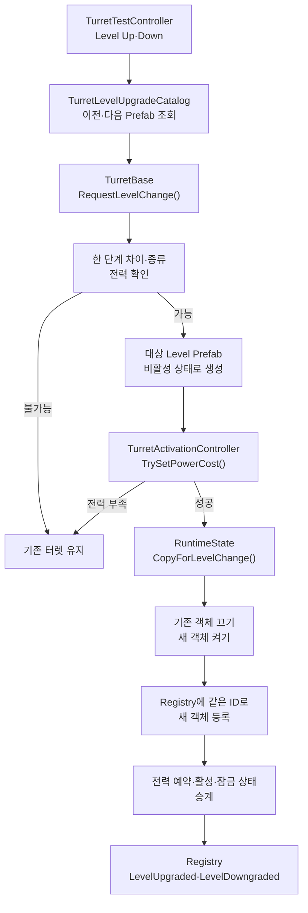

레벨 변경은 이전 또는 다음 레벨 프리팹으로 GameObject를 교체한다. 같은 `InstanceId`, 위치, 현재 체력 비율, 세부 업그레이드 보정과 적용 이력, 활성·잠금 상태 및 사거리 표시 설정을 이전한다. 체력 비율을 유지하므로 레벨 변경만으로 전체 회복되지는 않는다. 활성 터렛은 대상 레벨의 전력 사용량에 맞춰 예약량을 즉시 변경하며 전력이 부족하면 원래 터렛을 유지한다. 성공하면 방향에 따라 `LevelUpgraded` 또는 `LevelDowngraded` 이벤트가 발생한다. 읽기 전용 소비자는 객체 참조 대신 같은 ID로 스냅샷을 다시 조회한다. 이미 발사된 총알·미사일은 기존 발사체로 남는다.

현재 레벨 변경 비용·시간, 멀티플레이 상태 동기화, 파괴된 터렛의 변경 규칙은 확정되지 않았다. 파괴된 터렛의 레벨 변경 요청은 거부한다. 제품 UI에서 변경 버튼을 노출하는 작업은 아직 별도다.

`TurretTest`에서 Canon LV1 하나의 ID와 ControlUnit 전력을 기록하고 활성화·Damage·세부 업그레이드 후 `Level Up`을 누른다. LV2가 같은 ID와 체력 비율·보정값을 유지하는지 확인한다. 이어 `Level Down`으로 LV1에 돌아와 같은 항목을 재확인한다. Missile도 같은 순서로 확인한다. 여러 터렛을 켜 남은 전력을 낮춘 뒤 승급을 요청하면 부족한 전력으로 거부되는지도 확인할 수 있다. 이 Play Mode 검증은 코드 컴파일 검사와 별개다.

### 6.2 잠금과 해금

잠금은 Definition의 고정 능력치가 아니라 터렛 인스턴스의 런타임 상태다. 기본값은 해금 상태여서 기존 Prefab 동작을 바꾸지 않는다. `SetLocked(true)`는 활성 터렛을 먼저 끄고 예약 전력을 반환한 뒤 잠근다. 잠긴 터렛의 `RequestActivation(true)`는 `Locked`를 반환한다. `SetLocked(false)`로 해금해도 자동으로 켜지지 않으며 플레이어가 다시 활성화해야 한다. 잠금 상태는 레벨 변경 시 이어받고 읽기 전용 스냅샷의 `IsLocked`에도 반영된다. 기존 `TowerManager`는 잠긴 터렛에 `Locked`라고 표시하고 활성화 요청을 더 진행하지 않는다. `TurretTest`에는 잠금·해금 버튼이 있지만 제품 UI의 해금 동작과 비용·영구 저장 규칙은 아직 적용하지 않았다.

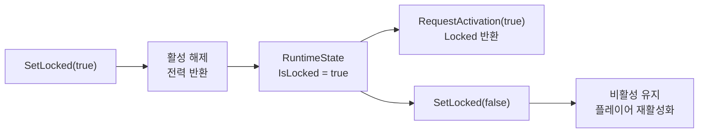

## 7. 멀티플레이 전환 시 주의점

현재 `InstanceId`는 각 프로세스에서 등록 순서대로 발급되는 **로컬 ID**다. Host와 Client에서 같은 터렛이 반드시 같은 숫자를 갖는다는 보장이 없다.

NGO 연동 시 다음 규칙을 적용한다.

- Host가 터렛 생성과 상태 변경의 Authority를 가진다.
- 네트워크 식별자는 NGO `NetworkObjectId` 또는 Host가 발급한 별도 ID를 사용한다.
- 활성화 요청은 Client가 직접 상태를 바꾸지 않고 Command/RPC로 Host에 요청한다.
- Host가 전력과 조건을 검증한 후 확정 상태를 복제한다.
- Definition 자체를 전송하지 않고 안정적인 `Definition.Id`와 필요한 Snapshot을 사용한다.
- 공격력 보너스와 파괴·수리 상태도 Authority가 확정한다.

현재 Registry의 로컬 `InstanceId`를 그대로 네트워크 ID로 보내면 안 된다. 실제 동기화 계약은 Co-op Milestone에서 `HostAuthority`, `MatchState`, NGO Adapter 경계와 함께 정한다.

## 8. AI·전선 시스템 연동 기준

Enemy PoC의 `PoCTargetSelector`는 `PoCTargetable` 컴포넌트를 수집한다. Stage 1 Canon/Missile Prefab에는 `TurretTargetableAdapter`와 `PoCTargetable`을 함께 붙였다. Adapter는 자신의 Transform으로 Registry에서 부모 터렛의 ID만 찾고, 그 ID의 스냅샷으로 현재·최대 체력과 활성·파괴 상태를 전달한다. `TurretBase` 참조를 보관하거나 상태를 직접 수정하지 않는다. 비활성·파괴된 터렛의 `PoCTargetable`은 비활성화되어 목표 후보에서 빠진다. 이 연결은 Enemy PoC 쪽에만 있고 `TeamHJD.Game.Turrets`는 Enemy assembly를 참조하지 않는다.

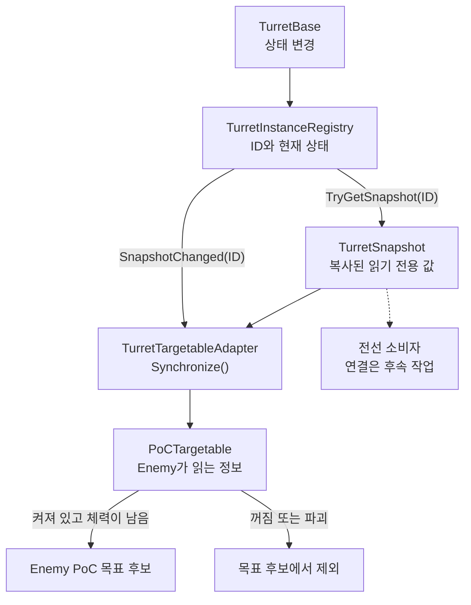

`FirepowerRatio`는 계산 기준이 아직 정해지지 않아 Adapter의 임시값 0.5를 사용한다. 세부 업그레이드와 레벨 승급으로 `EffectiveDamage`가 바뀌어도 이 비율은 아직 바뀌지 않는다. AI 평가 규칙을 정하면 `PoCTargetable.SetFirepower`에 실제 현재/최대 화력을 전달해야 한다.

전선 시스템과 후속 AI 계약에 제공할 후보 데이터는 다음과 같다.

- Instance ID와 Definition ID
- 위치와 소속 구역
- 활성화·잠금 여부
- 현재·최대 체력
- 공격력, 사거리, 전력 비용
- 공격 가능 여부와 과열 상태
- AI 목표 평가용 위협도·방어 가치

현재 읽기 전용 스냅샷은 ID·위치·상태·기본 평가값을 제공한다. Enemy PoC 어댑터는 이 계약으로 체력과 활성 상태를 읽는다. 전선 시스템의 실제 소비 코드는 아직 없어 연결되지 않았다. 소속 구역과 위협도·방어 가치의 최종 계산 역시 포함하지 않는다. `TurretRuntimeState`에 모든 Scene 참조와 AI 계산 결과를 무조건 넣지 않는다.

## 9. 검증 체크리스트

### 코드·에셋

- [ ] Definition ID가 비어 있지 않고 중복되지 않는다.
- [ ] Prefab에 올바른 Definition이 연결되어 있다.
- [ ] Stage 1 레벨 카탈로그의 네 경로가 실제 이전·다음 LV TurretBase Prefab을 가리킨다.
- [ ] Stage 1 Canon/Missile Prefab에 PoCTargetable과 Adapter가 함께 있다.
- [ ] TurretTest에서 활성화·피해·복구·세부 업그레이드·레벨 승급 전후 스냅샷을 ID로 재조회해 비교했다.
- [ ] `.cs`·`.asset`·Prefab의 `.meta`가 함께 존재한다.
- [ ] `TeamHJD.Game.Turrets`가 Contracts 외의 legacy assembly를 참조하지 않는다.
- [ ] Level 스크립트에 Definition 수치가 중복 하드코딩되지 않았다.
- [ ] Laser Turret을 실수로 Canon/Missile 변경 범위에 포함하지 않았다.

### TurretTest 조작 순서

기존 맵을 유지한 채 `Assets/Scenes/TestScene/TurretTest.unity`를 열고 Play Mode에 진입한다. 현재 Scene에는 Canon/Missile 업그레이드 에셋 4개와 Stage 1 양방향 레벨 카탈로그가 연결되어 있다. Rebuild 메뉴도 기존 참조를 보존하면서 누락된 샘플만 추가한다. 이번 기능 확인을 위해 Scene을 재구성할 필요는 없다.

1. `Capture Snapshot`으로 변경 전 값을 저장한다. 저장된 값은 ID별로 유지되므로 프리팹 교체 후에도 비교할 수 있다. 다시 누르면 비교 기준을 현재 값으로 바꾼다.
2. `Activate` 후 `Lock`을 누른다. 전력이 반환되고 현재 스냅샷의 Locked가 true인지 확인한다. `Request Activate`를 눌러 결과가 `Locked`인지 확인한다.
3. `Unlock` 후 자동 활성화되지 않는지 확인하고 직접 다시 켠다.
4. 각 터렛에 표시되는 `High Firepower` 또는 `Low Power`를 적용한다. 현재 Damage / Range / Power를 저장된 Before 값과 비교하고 `Show Range`로 표시 원도 확인한다. 같은 업그레이드는 인스턴스당 한 번만 적용할 수 있다. 각각의 단독 효과를 다시 확인하려면 Play Mode를 재시작한다.
5. `Level Up`과 `Level Down`으로 LV1↔LV2↔LV3를 왕복한다. ID와 보정값이 유지되는지 확인한다. LV1에는 Level Down이 없고 LV3에는 Level Up이 없다.
6. `Damage` → `Destroy` → `Request Activate` → `Restore`로 피해와 파괴 거부 및 복구를 확인한다. 복구해도 잠금 상태는 유지된다.
7. 패널의 All / Active / Operational 개수와 ID별 현재 스냅샷을 확인한다. Before 값은 이후 상태 변화에 따라 자동으로 바뀌지 않는다.

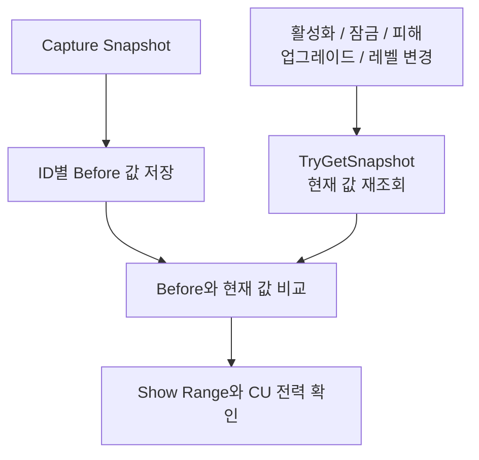

### Play Mode

- [ ] 6개 레벨별 터렛이 `TurretTest` Scene에서 활성화된다.
- [ ] 전력이 부족하면 활성화가 거부된다.
- [ ] 활성 터렛을 잠그면 비활성화되고 예약 전력이 반환된다.
- [ ] 잠긴 터렛은 켜지지 않고 해금 후 수동으로 다시 켤 수 있다.
- [ ] 비활성화하면 전력이 반환된다.
- [ ] `Damage`로 현재 체력이 감소한다.
- [ ] 현재 구현에서는 체력 0에서 파괴되고 예약 전력이 전량 반환된다. 향후 손실률 API 구현 시에는 0%·50%·100% 설정별 반환량을 별도로 검증한다.
- [ ] 파괴된 터렛은 활성화할 수 없다.
- [ ] `Restore` 후 최대 체력·비활성 상태로 돌아오며 다시 활성화할 수 있다.
- [ ] 파괴와 복구 시 Registry 이벤트가 한 번씩 발생한다.
- [ ] Target이 사망하거나 범위를 벗어나면 새 Target을 찾는다.
- [ ] Canon과 Missile의 표시 원·실제 탐지 범위가 EffectiveRange와 일치한다.
- [ ] 발사체 피해량이 Definition Damage와 Runtime Bonus를 반영한다.
- [ ] 과열 후 냉각과 재활성화가 정상 동작한다.
- [ ] 각 활성 터렛의 `InstanceId`가 0이 아니며 서로 다르다.
- [ ] Canon과 Missile을 각각 LV1→LV2→LV3으로 승급하며 발사구·공격 동작이 바뀐다.
- [ ] Canon과 Missile을 각각 LV3→LV2→LV1로 다운그레이드할 수 있다.
- [ ] 레벨 변경 전후 `InstanceId`, 체력 비율, 세부 업그레이드, 활성·잠금 상태가 유지된다.
- [ ] Canon과 Missile의 High Firepower는 Range -10%이고 Low Power는 Range +10%이며 탐지 범위와 표시 원에 즉시 반영된다.
- [ ] Capture Snapshot의 Before 값은 상태 변경 후에도 유지되고 같은 ID의 현재 스냅샷만 갱신된다.
- [ ] 활성 중 승급으로 증가한 전력만 추가 예약되고, 부족하면 승급이 거부된다.
- [ ] 꺼지거나 파괴된 터렛은 Enemy PoC의 목표 후보에서 빠진다.

## 10. 현재 기술 부채와 후속 작업

현재 구현에는 다음 전환기 의존성이 남아 있다.

| 항목 | 현재 상태 | 후속 방향 |
| --- | --- | --- |
| Control Unit 탐색 | `GameObject.Find("ControlUnit")` | Scene Composition에서 명시적으로 주입 |
| 등록부 | static 로컬 Registry | Match 수명주기의 조회 서비스로 이전 |
| 전력 변경 | `ITurretPowerSource`를 통해 legacy `ControlUnitStatus` 호출 | Command와 Authority 검증으로 분리 |
| 파괴 시 예약 전력 | 현재는 전량 반환 | 손실률(0~100%)을 터렛 API 입력값으로 열고 반환량을 조정 가능하게 한다. 제품 기본값과 반환 정책은 미정 |
| Target 평가 | concrete 코드가 Physics와 `Monster.isTargeted` 직접 사용 | AI/Combat 계약과 평가 모델 분리 |
| Namespace | 일부 concrete 터렛이 전역 namespace | 이식 시 `Presentation` 경계로 정리 |
| 네트워크 | 로컬 상태만 존재 | Host authoritative 상태와 Snapshot 추가 |
| AI 화력 평가 | Stage 1 Adapter에서 `FirepowerRatio = 0.5` 임시 사용 | 조수빈과 계산식·갱신 시점을 확정 |
| 레벨 승급 | Stage 1 카탈로그와 테스트 UI만 연결 | 제품 UI, 다른 Stage 경로, 비용·시간 및 참조 갱신 정책 검증 |
| Laser | 기존 독립 구조 유지 | 별도 Issue에서 행동 확인 후 이식 |

이 항목을 해결할 때 한 번에 전체 시스템을 다시 쓰지 않는다. observable behavior를 먼저 기록하고, 테스트 가능한 작은 Architecture Slice로 교체한다.

## 11. 관련 파일

- [`TurretBase.cs`](../../Assets/Scripts/Tower/Turret/Core/TurretBase.cs)
- [`TurretDefinition.cs`](../../Assets/Scripts/Tower/Turret/Core/TurretDefinition.cs)
- [`TurretRuntimeState.cs`](../../Assets/Scripts/Tower/Turret/Core/TurretRuntimeState.cs)
- [`TurretUpgradeDefinition.cs`](../../Assets/Scripts/Tower/Turret/Core/TurretUpgradeDefinition.cs)
- [`TurretLevelUpgradeCatalog.cs`](../../Assets/Scripts/Tower/Turret/Core/TurretLevelUpgradeCatalog.cs)
- [`TurretLevelUpgrade_Stage1.asset`](../../Assets/Scripts/Tower/TurretDefinitions/TurretLevelUpgrade_Stage1.asset)
- [`TurretTargetableAdapter.cs`](../../Assets/PoC/Enemy/Scripts/TurretTargetableAdapter.cs)
- [`TurretTestController.cs`](../../Assets/Scripts/Tower/Turret/TurretTestController.cs)
- [`TurretInstanceRegistry.cs`](../../Assets/Scripts/Tower/Turret/Core/TurretInstanceRegistry.cs)
- [`TeamHJD.Game.Turrets.Contracts.asmdef`](../../Assets/Scripts/Tower/Turret/Contracts/TeamHJD.Game.Turrets.Contracts.asmdef)
- [`TeamHJD.Game.Turrets.asmdef`](../../Assets/Scripts/Tower/Turret/Core/TeamHJD.Game.Turrets.asmdef)
- [`DefaultCanonTurret.cs`](../../Assets/Scripts/Tower/CanonTurret/DefaultCanonTurret.cs)
- [`DefaultMissileTurret.cs`](../../Assets/Scripts/Tower/MissileTurret/DefaultMissileTurret.cs)
- [`TowerBullet.cs`](../../Assets/Scripts/Tower/TurretWeapons/TowerBullet.cs)
- [`TowerMissile.cs`](../../Assets/Scripts/Tower/TurretWeapons/TowerMissile.cs)
