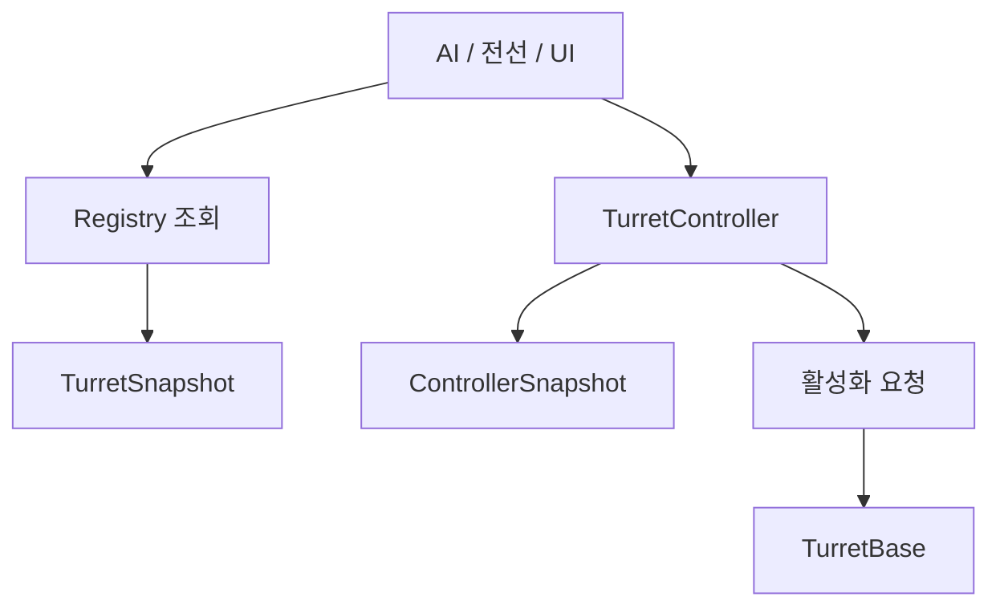

# 터렛 연동 가이드

최종 갱신: 2026-10-03
상태: Canon / Missile 구현 가이드. 제품 정책과 네트워크 계약은 별도 합의 대상.

다른 영역에서 터렛을 사용한다면 내부 구현부터 읽을 필요는 없다. 필요한 작업에 맞는 문서부터 확인한다.

| 하고 싶은 일 | 먼저 읽을 문서 |
| --- | --- |
| 테스트 씬에 터렛 배치 | [빠른 시작](quick-start.md) |
| 터렛 ID 조회와 활성화 또는 피해 적용 | [API 사용법](api-reference.md) |
| AI와 전선 및 UI에 값 제공 | [스냅샷](snapshots.md) |
| 발사부터 피격까지 실행 순서 확인 | [전체 구조와 Mermaid](../turret-system-guide.md) |
| 연동 전 확인해야 할 제약 | [검증과 제한 사항](testing.md) |

## 읽기와 변경의 경계

정보만 필요한 소비자는 `TurretSnapshot` 또는 `TurretControllerSnapshot`을 받는다. 복사본을 변경해서 터렛 상태를 바꿀 수는 없다. 상태 변경은 명령 API로 요청한다.

상세 구현의 원본은 [Turret System Guide](../turret-system-guide.md)다. 이 문서 묶음은 외부 사용자가 필요한 API를 찾기 위한 입구이며 새 게임 규칙을 정의하지 않는다.
