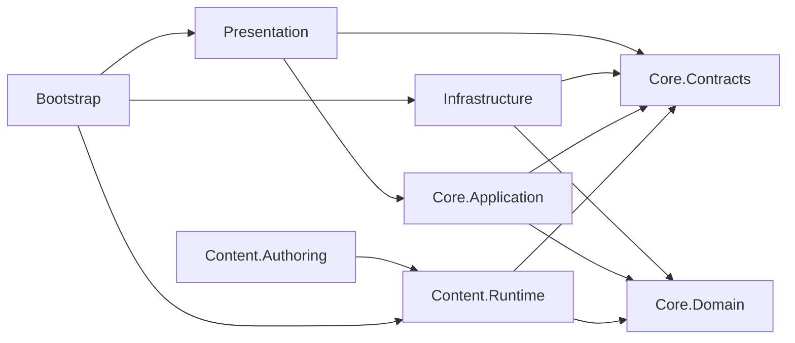

# Milestones and Core Design

기준일: 2026-09-20
상태: Milestone·Priority·기술 구현의 현행 기준 / Sprint 1 Stage 1 PoC 실행 중

이 문서는 M0~M5의 순서, 각 Priority에서 A~E가 맡는 책임, 기술 통과 기준을 정의한다. 제품 범위는 [PROJECT_PLAN.md](PROJECT_PLAN.md), 제품 영역 경계는 [TEAM_ROLE_OWNERSHIP.md](TEAM_ROLE_OWNERSHIP.md)를 따른다.

## 1. 운영 원칙

- 날짜보다 Exit Criteria를 우선한다.
- 한 Milestone의 P0가 끝나기 전 다음 Milestone을 시작하지 않는다.
- P0는 Milestone Gate, P1은 핵심 결과, P2는 품질 향상, P3는 미착수 아이디어다.
- P2는 P0/P1 일정에 여유가 있을 때만 수행한다.
- C와 D는 각각 김진태, 황재동이 담당하며, A가 해당 업무를 자동으로 떠안지 않는다.
- 기능 Owner는 구현·테스트·문서·통합 증거까지 책임진다. Build/CI/QA는 E의 전담 업무가 아니다.
- 실제 외부 SDK와 Online 기능은 Single-player Core가 검증된 뒤 연결한다.

## 2. 전체 Roadmap

| Milestone | 권장 범위 | 핵심 결과 | 다음 단계 Gate |
| --- | --- | --- | --- |
| M0 · Alignment & Baseline | Sprint 0, 1주 | 팀 기준·역할·CI·제품/기술 Backlog 확정 | P0 완료, Build/CI 성공, 전원 역할·가용 시간 확인 |
| M1 · New Core Foundation | 2~3 Sprints | 레거시 없이 테스트 가능한 App/Profile/Content/Match 기반 | Minimal Test Scene과 EditMode Test 통과 |
| M2 · Single-player Vertical Slice | 3~4 Sprints | 15~20분 Spaceship↔Planet 1 검증판 | 외부 Playtest와 Product 지표 통과 |
| M3 · 2-player Co-op MVP | 2~3 Sprints | Steam Invite 기반 2인 Match와 이탈자 AI 대체 | 2 Client 반복 완주와 보상 일관성 |
| M4 · Online Expansion & Alpha | 범위 승인 후 3~5 Sprints | Online UX, 운영 Backend, Content Pipeline과 Alpha | 전체 예정 Content 완주, 운영·복구 검증 |
| M5 · Beta & Release | 2~3 Sprints | 기능 동결, QA, 최적화, Steam 출시 후보 | Clean Install·Save·License·Release Build 통과 |

기간은 5인 파트타임 팀을 위한 계획값이다. 개인 가용 시간, 시험 기간, 기술 PoC 결과에 따라 Sprint 계획에서 재산정한다.

## 현재 Time-box — Sprint 1 Stage 1 PoC

2026-09-19 회의 결정에 따라 2026-10-02까지 터렛 중심 전선 운영의 핵심 재미와 구현 가능성을 통합 검증한다. 이 PoC는 M1/M2의 일부 위험을 앞당겨 확인하는 실험이며 기존 Milestone Gate를 자동 통과시키지 않는다. 프로덕션 코드로 이식할 부분은 PoC 결과와 M1 계약 검토 뒤 결정한다.

| 연결 순서 | Owner | 결과물 |
| --- | --- | --- |
| 범위·계약·통합 기준 | A · 양현석 | Issue, 인터페이스, 임시 승패 조건, 10월 2일 통합 Build |
| Network-aware 위험 조사 | B · 이영빈 | Netcode/RPC/권한 최소 가이드와 향후 전환 위험 목록 |
| 터렛 상태 데이터 | D · 황재동 | 터렛 인스턴스 관리, 위치·활성·체력·화력·거리·위협도 제공 |
| 목표 선택 AI | E · 조수빈 | 터렛 점수 기반 brute-force 타게팅, 경로·목표 전환·Spawn 실험 |
| 전선·거점 확장 | C · 김진태 | Graybox, 거점 확보·상실, 전장 확장과 E/D 데이터 연동 |
| 통합 Playtest | 전체 팀 | 2026-10-02 같은 Build에서 플레이, 2026-10-03 피드백 회의 |

상세 범위와 완료 기준은 [SPRINT_1_STAGE_1_POC.md](SPRINT_1_STAGE_1_POC.md)를 따른다.

## 3. 공통 역할 코드

| 코드 | 이름 | 고정 제품 영역 |
| --- | --- | --- |
| A | 양현석(PL) | Core lifecycle, 계약, Profile/Economy 정책, Meta UI, 통합 결정 |
| B | 이영빈 | Player gameplay, Combat HUD, 입력/카메라, Co-op UX, 실시간 연출 |
| C | 김진태 | Planet/Hub World, Mission/Expansion, 환경, Ally Player Agent |
| D | 황재동 | Turret/Power, Research/Progression, 전투·경제 Balance |
| E | 조수빈 | Enemy/Boss, Encounter/Wave, 공통 AI runtime |

## 4. M0 — Alignment & Baseline

### 목표

New Core를 시작하기 전에 팀이 같은 범위·역할·완료 기준을 사용하고, 모든 변경을 검증할 수 있는 저장소 상태를 만든다.

| Priority | A — 양현석 | B — 이영빈 | C — 김진태 | D — 황재동 | E — 조수빈 |
| --- | --- | --- | --- | --- | --- |
| P0 | Scope·Decision Log 승인, M1 Architecture Backlog, CI/Branch rule 최종 확인 | Player/Input/HUD 레거시 행동 목록과 M1 Command 경계 작성 | Planet/Hub topology·Expansion 요구사항 작성 | Turret/Power 역할표와 Paper Simulation | Enemy/Wave 레거시 행동 목록, Enemy 1종·Director 최소 범위 작성 |
| P1 | App/Profile/Content/Match 책임도와 asmdef 계획 | M1 Minimal HUD wireframe, Player damage/command Test Case | Planet 50/75/100 Graybox와 Hub 동선 초안 | Cannon/Missile/Laser 역할·Cost·Counter 초안 | Default/Tanker/Assassin/Boss 역할·첫 등장 초안 |
| P2 | License inventory 시작, CI 문서화 | Playtest 질문과 입력 접근성 위험 | 환경 기믹 후보와 Scene 분리안 | Balance sheet 양식과 검증식 | AI profile 양식과 성능 목표 초안 |
| P3 | Online SDK 도입, 실제 Backend | Cinematic 제작 | Planet 2, Rival Agent | 대형 Research Tree | 다수 Enemy 양산 |

#### M0 Exit Criteria

- Unity Compile Error 0, Repository Check와 필수 CI 성공
- Source of Truth와 A~E 역할이 팀에 공유됨
- 각 P0 Task에 예상 시간·선행 작업·검증 방법·증거 위치가 있음
- C 김진태와 D 황재동을 포함한 전원의 역할·가용 시간이 기록됨
- M1 Minimal Test Scene 범위와 asmdef 의존 방향이 승인됨
- Planet 1, Turret, Enemy, Hub Paper Design이 M2 준비 자료로 연결됨

## 5. M1 — New Core Foundation

### 정확한 범위

M1은 실제 Steam, Backend, Netcode, 완성된 Hub 또는 Planet 콘텐츠를 만드는 단계가 아니다. 외부 기능을 나중에 붙일 수 있는 계약과 수명주기, 테스트 가능한 Single Match의 Architecture Slice를 만든다.

| Priority | A — 양현석 | B — 이영빈 | C — 김진태 | D — 황재동 | E — 조수빈 |
| --- | --- | --- | --- | --- | --- |
| P0 | `AppBootstrap/AppRoot`, IDs·Command·Event·Result, `MatchSession/MatchState/GameSimulation`, Profile/Content Port와 Fake, asmdef 경계 | `PlayerAction`→`GameCommand` adapter, Player HP 표현과 최소 `HudPresenter` | `PlanetDefinition/MissionDefinition/SectorDefinition` 최소 schema와 Test Scene 공간 | `TurretDefinition/PowerDefinition`, 전력 소비·반환 규칙과 테스트 값 | `EnemyArchetype`, Enemy Command 경계, Enemy 1종과 최소 `EncounterDirector` |
| P1 | immutable `MatchConfig`, `LocalAuthority`, `RewardReceipt`, versioned binary cache interface/개발 구현 | 이동·사격·피격 최소 adapter, HUD 구독/해제 Test | Control Unit·Spawn Point·Sector marker adapter | Cannon 1종과 Power ON/OFF를 Simulation에 연결 | Default Enemy spawn/defeat를 Command/Event로 연결 |
| P2 | Error model, logging, architecture tests, Fake failure cases | 입력 피드백과 Debug overlay | Test Scene 가독성·authoring validator | 간단한 Power simulation tool | AI profile validator와 간단한 path/performance 측정 |
| P3 | Steamworks, 실제 HTTP Backend, NGO/Relay | Co-op UI, 장편 연출 | 완성 Hub/Planet, Ally AI | 3종 터렛 완성, 대형 성장 | Boss·Enemy 다종 양산 |

#### M1 Core 계약

```text
Input / AI / future Network
        ↓ GameCommand
LocalAuthority
        ↓
MatchSession → GameSimulation → MatchState
        ├→ typed Match Event → Presenter
        └→ MatchResult → RewardReceipt → IProfileService
```

- `AppRoot`만 App 수명을 갖고 `DontDestroyOnLoad`를 사용할 수 있다.
- `MatchSession`은 plain C# `IDisposable`이며 매 Match마다 생성·파기한다.
- Domain/Application은 Unity, Steam, HTTP, Netcode 타입을 참조하지 않는다.
- ScriptableObject는 authoring 원본이며 Match 시작 시 immutable `MatchConfig`로 해석한다.
- Local binary는 versioned cache다. Backend adapter와 같은 권한 저장소로 취급하지 않는다.

#### M1 Exit Criteria

1. Main/GeneralManager/GameManager/DataManager 없이 Minimal Test Scene이 실행된다.
2. Player/CU HP, Wave, Match result의 원본은 `MatchState` 하나다.
3. Player와 Enemy 행동이 Command를 통해 Simulation에 들어간다.
4. HUD가 상태 변경을 구독하고 Manager/Scene object를 폴링하지 않는다.
5. Clear/Fail이 한 번의 `RewardReceipt`를 생성한다.
6. Fake Platform/Profile/Content만으로 EditMode Test가 실행된다.
7. 새 Core에 `Find`, `*.Instance`, 레거시 Manager 참조가 없다.
8. M1 P0 테스트와 필수 CI가 모두 통과한다.

## 6. M2 — Single-player Product Vertical Slice

### 목표

M1 계약 위에 15~20분짜리 Spaceship 준비 → Planet 전투·Expansion → Result·Return 경험을 완성한다.

| Priority | A — 양현석 | B — 이영빈 | C — 김진태 | D — 황재동 | E — 조수빈 |
| --- | --- | --- | --- | --- | --- |
| P0 | Mission→MatchConfig→Result→Profile 왕복, Scene Flow, Meta UI, Single ModeRules | Player 전투 1세트, Combat HUD, Tutorial, Camera/Input | Planet 1 Full Graybox, 50/75/100 Expansion, Hub Interior·Mission 동선 | Cannon/Missile/Laser, Power Budget/회수, Upgrade 1개, 핵심 Balance | 3 Enemy Archetype, Wave/Spawn curve, Boss 1종과 Fail/Clear 연동 |
| P1 | Save/cache migration, Result/Retry, 공통 UI navigation | 피격·사격·터렛 상태 feedback, 짧은 Launch/Return 연출 | 65/90% 설계 초안, 환경 Storytelling, Minimap/Collision/Spawn 갱신 | Counter table, 두 Clear 가능 build, in-wave 전환 제한 조정 | 혼합 Wave, Boss phase, AI profile·성능 tuning |
| P2 | Debug tools와 telemetry event, 오류 메시지 | 접근성·가독성·Audio/VFX 연결 | 환경 기믹 후보 1개와 시각적 polish | Balance simulation 자동화 | Object pooling·profiling과 연출 polish |
| P3 | Online, 실제 Backend 운영 | Co-op UI | Planet 2, 대형 Hub | Sector 일괄 전원, 다수 Upgrade | Enemy 대량 추가 |

#### M2 Exit Criteria

- Hub → Mission → Planet → Result → Hub를 5회 연속 Blocker/Console Error 없이 완주
- 서로 다른 Turret Build 2개 이상으로 Clear 가능
- Expansion이 공격 방향과 Power 배분을 실제로 변경
- Locked Sector에서 Collision/Projectile/Spawn 누출 없음
- 외부 Tester 5명 중 4명이 Power, Expansion, 다음 행동을 설명 없이 이해
- Target PC 성능 하한, Save/Retry, Missing Reference 검증 통과

## 7. M3 — 2-player Co-op MVP

### 목표

M2의 동일한 `GameSimulation`을 사용해 Steam 친구 초대 기반 2-player Match를 만든다. Random Match, SOS, Chat/Ping, 실제 Host Migration은 포함하지 않는다.

| Priority | A — 양현석 | B — 이영빈 | C — 김진태 | D — 황재동 | E — 조수빈 |
| --- | --- | --- | --- | --- | --- |
| P0 | Steam identity/Lobby/Network adapter 경계, Host authority, replicated command/snapshot, 보상 중복 방지 | Invite/Lobby/Ready/Reconnect UX, 2-player HUD·Ping 최소 표현 | Player slot, 이탈자 `AllyPlayerAgent` 정책·Mission 행동 구현 | Co-op Turret/Power 공유 규칙, 난이도·보상 profile | AI runtime 재사용, Enemy/Director authority와 deterministic 검증 지원 |
| P1 | 연결 종료·복귀 state, Match 결과 검증과 로깅 | Player 구분·상호 feedback, 오류/재시도 화면 | Ally AI takeover/return과 목표 우선순위 | 1인/2인 Scaling, griefing 방지 전력 규칙 | 2인 부하의 Wave/AI 성능과 Network action 검증 |
| P2 | Network diagnostics와 reconnect test harness | Chat/Ping UX prototype | Co-op 공간/미션 보조 기믹 | 역할 분담을 유도하는 Balance 실험 | AI teammate 협업 개선 |
| P3 | Random Match, SOS, 실제 Host Migration | 장편 Co-op 연출 | Rival Agent | 경쟁 Economy | PvP Enemy/Agent |

#### M3 Exit Criteria

- 두 Client가 Invite→Ready→Match→Result를 10회 반복 완주
- 같은 Seed/Command에서 핵심 Match 결과와 보상이 일치
- 참가자 이탈 후 예약된 Slot을 Ally AI가 이어받고 재접속 시 복귀 가능
- 중복 RewardReceipt, 진행 불가 desync, 치명적 Network Error 0
- Single-player M2 회귀 테스트 통과

## 8. M4 — Online Expansion & Alpha

### 목표

검증된 Single/Co-op 위에 운영에 필요한 Online 기능과 반복 Content 제작 구조를 추가하고, 예정한 Alpha 범위를 처음부터 끝까지 실행 가능하게 만든다.

| Priority | A — 양현석 | B — 이영빈 | C — 김진태 | D — 황재동 | E — 조수빈 |
| --- | --- | --- | --- | --- | --- |
| P0 | 실제 Backend Profile/Reward validation, schema migration, 운영 로그·복구, Offline 정책 결정 | Random Match/SOS/Reconnect의 핵심 UX와 오류 복구 | Planet 1의 1-1~1-5, Mission/Environment Content Pipeline | Data-driven Turret/Power/Research/Balance Pipeline | Data-driven Enemy/Wave/Boss Pipeline과 Alpha Encounter |
| P1 | Leaderboard/운영 도구, Host Migration Snapshot PoC | Chat/Ping, Onboarding과 주요 Cutscene polish | 추가 Mission/Challenge, Hub 변화와 환경 기믹 | 성장/경제 curve와 Co-op tuning | Enemy/Boss 변형과 성능 최적화 |
| P2 | 관측성 dashboard·support tool | 접근성·Localization·UX polish | 선택된 추가 Planet Graybox | 선택된 추가 Upgrade/터렛 | 선택된 추가 Enemy/Encounter |
| P3 | 실제 Host Migration 도입, PvP | 대규모 Social 기능 | Planet 대량 생산, Rival Agent | 대형 Economy | PvP Agent/Director |

#### M4 Exit Criteria

- 예정한 Alpha Content가 Single/Co-op에서 처음부터 끝까지 실행 가능
- 코드 분기 추가 없이 Definition으로 Stage/Wave/Turret/Enemy 수치·구성을 변경 가능
- Backend 장애·재시도·중복 요청·Profile migration 검증 통과
- Random/SOS 등 선택된 P1 기능은 개별 Exit Criteria를 통과한 것만 Alpha 범위에 포함
- Host Migration은 PoC 결과와 비용을 Decision Log에 기록하며, 실패해도 M4 전체를 자동 실패시키지 않음

## 9. M5 — Beta & Release

### 목표

기능을 동결하고 품질, 성능, 라이선스, 운영, Steam 배포를 검증해 Release Candidate를 만든다.

| Priority | A — 양현석 | B — 이영빈 | C — 김진태 | D — 황재동 | E — 조수빈 |
| --- | --- | --- | --- | --- | --- |
| P0 | Scope freeze, Release Build, Backend/Profile/Save 복구, Steam 배포·문서·승인 | 입력/HUD/접근성 Blocker와 사용자 흐름 QA | Scene/Collision/Mission Blocker, Asset license/source 정리 | Economy/Progression exploit와 필수 Balance | AI/Encounter 진행 불가·Crash·성능 Blocker |
| P1 | Analytics/운영 Runbook, Credits, Store/Release checklist | UX·Localization·Cinematic polish | Art/VFX/환경 polish와 탐색 가독성 | 난이도·보상·터렛 미세 조정 | Wave/Boss/AI 미세 조정과 pooling |
| P2 | 개발자 편의와 post-launch backlog 정리 | 선택적 feedback polish | 선택적 환경 polish | 선택적 Balance variation | 선택적 Enemy variation |
| P3 | 신규 핵심 기능, 실제 Host Migration, PvP | 새 Social 기능 | 새 Planet | 새 성장 축 | 새 AI 계열 |

#### M5 Exit Criteria

- Clean Install, Update, Save migration/reset, Steam Launch 테스트 통과
- 필수 CI, Windows Release Build, 장시간 Playtest 성공
- Crash·Progression Blocker·Save Corruption 0, 승인된 Major Bug 0
- 모든 배포 Asset의 상업 사용 권리와 Credits 확인
- Backend 운영·장애 대응·Rollback 절차 확인
- Release Candidate tag와 복구 가능한 artifact 보관

## 10. 의존성 방향

화살표는 `참조하는 쪽 → 참조되는 쪽`을 뜻한다.



`Core.Domain`과 `Core.Contracts`는 Unity API를 참조하지 않는다. `Core.Application`은 Domain/Contracts만 참조한다. 외부 SDK 타입은 Infrastructure 밖으로 노출하지 않는다.

## 11. 변경 통제

- Milestone 이름·순서·Exit Criteria 변경은 이 문서와 `PROJECT_PLAN.md` Decision Log를 함께 수정한다.
- P3를 P0/P1으로 올릴 때는 같은 크기의 작업을 빼거나 기간을 다시 산정한다.
- Owner 변경은 `TEAM_ROLE_OWNERSHIP.md`와 현재 Backlog를 함께 수정한다.
- 통과 증거는 GitHub Issue/PR, CI Run, Build, Playtest 기록 중 하나 이상으로 남긴다.
